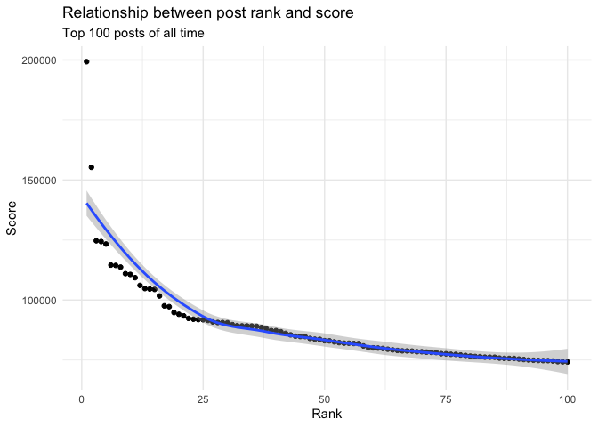

# Introduction

A few months ago I noticed that one subreddit I frequent, [r/science](reddit.com/r/science), had a growing proportion of pop-psychology posts getting many upvotes. Reddit is a social media site, and scientific journals are notoriously hard to access, so I expected a gap between the types of science content they feature. Still, I decided to test my gut feeling that the subreddit's content was changing.

In this project I analyzed the top posts of r/science, and investigated which topics interest r/science users the most. I also analyzed post titles through sentiment analysis and word clouds, since titles are what users first see when engaging with content.


# Scraping Reddit with PRAW

I used a Python script to scrape r/science top 100 posts over three time periods: the past month, the past year, and all-time. Within these time periods I obtained data for 9 different variables:

* `...1` ranks the post from 0-99 (0 being the highest rank).
* `id` is a unique string of letters and numbers that identify each post.
* `created_unix_utc` is the time the post was created (as a unix number).
* `post_url` is the url for the website the post links to. This can be from an online news outlet, journal, etc.
* `post_title` is the title of the post.
* `flair` is a tag attached to each post by a moderator that places that post in a category. It represents the post's topic.
* `score` is the number of times a post was upvoted (each user can upvote a post once).
* `num_comments` is the number of unique comments on a post.
* `upvote_ratio` is the ratio of upvotes (indicating user approval) to downvotes (indicating user disapproval). 

The script won't run here; to run this code yourself, you'll need to follow the instructions in [this guide](https://praw.readthedocs.io/en/stable/) using your own credentials.


```python
# import packages
import praw
import pandas

# read-only instance
reddit_read_only = praw.Reddit(
    client_id="", #your info here
    client_secret="", #your info here
    user_agent="", #your info here
)

# extract subreddit information

subreddit = reddit_read_only.subreddit("science")

# display subreddit name

print("Display Name:", subreddit.display_name)

# display subreddit title
print("Title:", subreddit.title)

# display subreddit description
print("Description:", subreddit.description)

# get top posts this from time period
# all = all time
# year = past year
# month = past month
posts = subreddit.top("all")

posts_dict = { 
    "id": [],
    "created_unix_utc": [],
    "post_url": [],
    "post_title": [],
    "flair": [],
    "score": [],
    "num_comments": [],
    "upvote_ratio": []
}

for post in posts:
    posts_dict["id"].append(post.id)
    posts_dict["created_unix_utc"].append(post.created_utc)
    posts_dict["post_url"].append(post.url)
    posts_dict["post_title"].append(post.title)
    posts_dict["flair"].append(post.link_flair_text)
    posts_dict["score"].append(post.score)
    posts_dict["num_comments"].append(post.num_comments)
    posts_dict["upvote_ratio"].append(post.upvote_ratio)

# change this when scraping different time periods
top_posts_all= pandas.DataFrame(posts_dict)
top_posts_all

top_posts_all.to_csv("Top-Posts-All.csv")
# repeat for past year, past month
```


# Data Cleaning

I conducted all cleaning, analysis, and visualization in R.

```r
library(tidyverse) # data processing and analysis
```

```
## ── Attaching packages ─────────────────────────────────────── tidyverse 1.3.2 ──
## ✔ ggplot2 3.4.0      ✔ purrr   1.0.1 
## ✔ tibble  3.1.8      ✔ dplyr   1.0.10
## ✔ tidyr   1.2.1      ✔ stringr 1.5.0 
## ✔ readr   2.1.3      ✔ forcats 0.5.2 
## ── Conflicts ────────────────────────────────────────── tidyverse_conflicts() ──
## ✖ dplyr::filter() masks stats::filter()
## ✖ dplyr::lag()    masks stats::lag()
```

```r
library(lubridate) # wrangle dates
```

```
## Loading required package: timechange
## 
## Attaching package: 'lubridate'
## 
## The following objects are masked from 'package:base':
## 
##     date, intersect, setdiff, union
```

```r
library(skimr) # skim data frames
library(urltools) # wrangle urls
library(tidytext) # NLP toolkit
library(textdata) # Sentiment analysis
library(wordcloud2) # Word clouds
library(gghighlight) # Adding highlight to graphs
library(wesanderson) # graph colors
```

## Get the Raw Data {.tabset}

### All time

```r
# create data frame with top 100 posts from all time
top_all <- read_csv("Top-Posts-All.csv")
```

```
## New names:
## Rows: 100 Columns: 9
## ── Column specification
## ──────────────────────────────────────────────────────── Delimiter: "," chr
## (4): id, post_url, post_title, flair dbl (5): ...1, created_unix_utc, score,
## num_comments, upvote_ratio
## ℹ Use `spec()` to retrieve the full column specification for this data. ℹ
## Specify the column types or set `show_col_types = FALSE` to quiet this message.
## • `` -> `...1`
```

```r
summary(top_all)
```

```
##       ...1            id            created_unix_utc      post_url        
##  Min.   : 0.00   Length:100         Min.   :1.438e+09   Length:100        
##  1st Qu.:24.75   Class :character   1st Qu.:1.555e+09   Class :character  
##  Median :49.50   Mode  :character   Median :1.590e+09   Mode  :character  
##  Mean   :49.50                      Mean   :1.581e+09                     
##  3rd Qu.:74.25                      3rd Qu.:1.610e+09                     
##  Max.   :99.00                      Max.   :1.668e+09                     
##   post_title           flair               score         num_comments  
##  Length:100         Length:100         Min.   : 74211   Min.   : 1113  
##  Class :character   Class :character   1st Qu.: 77535   1st Qu.: 1950  
##  Mode  :character   Mode  :character   Median : 83020   Median : 2882  
##                                        Mean   : 88449   Mean   : 3358  
##                                        3rd Qu.: 91584   3rd Qu.: 4048  
##                                        Max.   :199299   Max.   :10930  
##   upvote_ratio   
##  Min.   :0.7100  
##  1st Qu.:0.8400  
##  Median :0.9000  
##  Mean   :0.8819  
##  3rd Qu.:0.9225  
##  Max.   :0.9600
```

### Past year

```r
# create data frame with top 100 posts from last year
top_year <- read_csv("Top-Posts-Year.csv")
```

```
## New names:
## Rows: 100 Columns: 9
## ── Column specification
## ──────────────────────────────────────────────────────── Delimiter: "," chr
## (4): id, post_url, post_title, flair dbl (5): ...1, created_unix_utc, score,
## num_comments, upvote_ratio
## ℹ Use `spec()` to retrieve the full column specification for this data. ℹ
## Specify the column types or set `show_col_types = FALSE` to quiet this message.
## • `` -> `...1`
```

```r
summary(top_all)
```

```
##       ...1            id            created_unix_utc      post_url        
##  Min.   : 0.00   Length:100         Min.   :1.438e+09   Length:100        
##  1st Qu.:24.75   Class :character   1st Qu.:1.555e+09   Class :character  
##  Median :49.50   Mode  :character   Median :1.590e+09   Mode  :character  
##  Mean   :49.50                      Mean   :1.581e+09                     
##  3rd Qu.:74.25                      3rd Qu.:1.610e+09                     
##  Max.   :99.00                      Max.   :1.668e+09                     
##   post_title           flair               score         num_comments  
##  Length:100         Length:100         Min.   : 74211   Min.   : 1113  
##  Class :character   Class :character   1st Qu.: 77535   1st Qu.: 1950  
##  Mode  :character   Mode  :character   Median : 83020   Median : 2882  
##                                        Mean   : 88449   Mean   : 3358  
##                                        3rd Qu.: 91584   3rd Qu.: 4048  
##                                        Max.   :199299   Max.   :10930  
##   upvote_ratio   
##  Min.   :0.7100  
##  1st Qu.:0.8400  
##  Median :0.9000  
##  Mean   :0.8819  
##  3rd Qu.:0.9225  
##  Max.   :0.9600
```


### Past month

```r
# create data frame with top 100 posts from last year
top_month <- read_csv("Top-Posts-Month.csv")
```

```
## New names:
## Rows: 100 Columns: 9
## ── Column specification
## ──────────────────────────────────────────────────────── Delimiter: "," chr
## (4): id, post_url, post_title, flair dbl (5): ...1, created_unix_utc, score,
## num_comments, upvote_ratio
## ℹ Use `spec()` to retrieve the full column specification for this data. ℹ
## Specify the column types or set `show_col_types = FALSE` to quiet this message.
## • `` -> `...1`
```

```r
summary(top_month)
```

```
##       ...1            id            created_unix_utc      post_url        
##  Min.   : 0.00   Length:100         Min.   :1.668e+09   Length:100        
##  1st Qu.:24.75   Class :character   1st Qu.:1.669e+09   Class :character  
##  Median :49.50   Mode  :character   Median :1.670e+09   Mode  :character  
##  Mean   :49.50                      Mean   :1.670e+09                     
##  3rd Qu.:74.25                      3rd Qu.:1.670e+09                     
##  Max.   :99.00                      Max.   :1.671e+09                     
##   post_title           flair               score        num_comments   
##  Length:100         Length:100         Min.   : 3818   Min.   :  39.0  
##  Class :character   Class :character   1st Qu.: 6746   1st Qu.: 367.2  
##  Mode  :character   Mode  :character   Median :12932   Median : 715.0  
##                                        Mean   :18299   Mean   :1054.4  
##                                        3rd Qu.:25152   3rd Qu.:1342.0  
##                                        Max.   :75014   Max.   :6759.0  
##   upvote_ratio   
##  Min.   :0.6700  
##  1st Qu.:0.8875  
##  Median :0.9400  
##  Mean   :0.9114  
##  3rd Qu.:0.9600  
##  Max.   :0.9800
```

## Data Transformation


Column 1 represents post rank. I changed the column name and added 1 to all rankings (so that posts would be ranked from 1 to 100).

```r
# change column 1 name from ...1 to rank
colnames(top_all)[1] <- "all_rank"
colnames(top_year)[1] <- "year_rank"
colnames(top_month)[1] <- "month_rank"

# add 1 to all the rankings for clarity
top_all$all_rank <- as.numeric(top_all$all_rank) + 1
top_year$year_rank <- as.numeric(top_year$year_rank) + 1
top_month$month_rank <- as.numeric(top_month$month_rank) + 1
```

I converted the `created_unix` field from a number to a datetime, and save this as `created_utc`. This represents the time each post was made in UTC.

```r
top_all$created_utc <- as_datetime(top_all$created_unix_utc)
top_year$created_utc <- as_datetime(top_year$created_unix_utc)
top_month$created_utc <- as_datetime(top_month$created_unix_utc)
```

I isolated the domain name from each url, and saved this as `post_url`. The domain is the source website for each post. Sources include news outlets, science magazines, journals, blogs, etc.

```r
top_all$domain <- domain(top_all$post_url)
top_year$domain <- domain(top_year$post_url)
top_month$domain <- domain(top_month$post_url)
```

I saved the cleaned and transformed data to fresh data frames. I also created data frames containing just the post titles.

```r
# create clean df - all data
all_clean <- top_all
year_clean <- top_year
month_clean <- top_month

# create text df - titles only
text_month <- all_clean[c("post_title")]
text_year <- year_clean[c("post_title")]
text_all <- month_clean[c("post_title")]
```

## Cleaning Text

I analyzed word frequencies in post titles. To do this I needed to restructure the data frame so that each title word has its own column (each row still represents one post).

```r
# restructure one token per row: unnest tokens
text_all <- text_all %>% 
  unnest_tokens(word, post_title)

text_month <-text_month %>% 
  unnest_tokens(word, post_title)

text_year <- text_year %>% 
  unnest_tokens(word, post_title)
```

I removed stopwords using the tidytext package's stopword list. Stopwords are common words like "a" and "the" that are very common and not meaningful. There were a few words generic science words in the data sets that I wanted to filter out, such as "study", "found", "suggests", and "research". I also filtered out numerals.

```r
# get stop words list
data("stop_words")

num_text_all <- text_all %>% 
  arrange(word) %>% 
  head(75)

num_text_year <- text_year %>% 
  arrange(word) %>% 
  head(89)

num_text_month <- text_month %>% 
  arrange(word) %>% 
  head(91)

stop_science <- c("study", "found", "scientist", "scientists", "research", "researchers", "suggests", "finding")
stop_science <- as.data.frame(stop_science)
colnames(stop_science)[1] <- "word"
```

## Word Frequencies Lists {.tabset}

I created lists of the most frequently used words in titles.

### All time


```r
# filter stopwords
# filter stopwords
text_all_clean <- text_all %>% 
  anti_join(stop_words, by = "word")

text_all_clean <- text_all_clean %>% 
  anti_join(num_text_year, by = "word")

text_all_clean <- text_all_clean %>% 
  anti_join(stop_science, by = "word")

# show 10 most frequent words
text_all_clean %>% 
  count(word, sort = TRUE)%>% 
  head(10)
```

```
## # A tibble: 10 × 2
##    word        n
##    <chr>   <int>
##  1 covid      16
##  2 people     15
##  3 sexual     10
##  4 risk        8
##  5 cancer      7
##  6 women       7
##  7 health      6
##  8 vaccine     6
##  9 white       6
## 10 brain       5
```

### Past year

```r
# filter stopwords
text_year_clean <- text_year %>% 
  anti_join(stop_words, by = "word")

text_year_clean <- text_year_clean %>% 
  anti_join(num_text_year, by = "word")

text_year_clean <- text_year_clean %>% 
  anti_join(stop_science, by = "word")

# show 10 most frequent words
text_year_clean %>% 
  count(word, sort = TRUE) %>% 
  head(10)
```

```
## # A tibble: 10 × 2
##    word          n
##    <chr>     <int>
##  1 people       11
##  2 black        10
##  3 covid        10
##  4 americans     9
##  5 women         8
##  6 increased     7
##  7 lungs         7
##  8 rates         7
##  9 adults        6
## 10 billion       6
```

### Past month

```r
# filter stopwords
text_month_clean <- text_month %>% 
  anti_join(stop_words, by = "word")

text_month_clean <- text_month_clean %>% 
  anti_join(num_text_year, by = "word")

text_month_clean <- text_month_clean %>% 
  anti_join(stop_science, by = "word")

# show 10 most frequent words
text_month_clean %>% 
  count(word, sort = TRUE) %>% 
  head(10)
```

```
## # A tibble: 10 × 2
##    word               n
##    <chr>          <int>
##  1 people            12
##  2 human             10
##  3 children           8
##  4 covid              8
##  5 sex                8
##  6 students           8
##  7 time               8
##  8 cannabis           7
##  9 life               7
## 10 administration     6
```

# Data Exploration

## Get the Clean Data {.tabset}

I created individual data frames for the top 100 posts of all time, the last year, and the last month. I also created data frames containing just the post titles for each time period. I did not combine these data frames because they each represent a different timescale.

### All time

The oldest post on the all time list is from 2015, and the median year for posts is from 2020. The subreddit has been growing over time.

```r
# Whole dataset
all_clean <- read.csv("~/Documents/Projects/reddit-science/all_clean.csv")

# Post titles only
text_all_clean <- read.csv("~/Documents/Projects/reddit-science/text_all_clean.csv")

summary(top_all)
```

```
##     all_rank           id            created_unix_utc      post_url        
##  Min.   :  1.00   Length:100         Min.   :1.438e+09   Length:100        
##  1st Qu.: 25.75   Class :character   1st Qu.:1.555e+09   Class :character  
##  Median : 50.50   Mode  :character   Median :1.590e+09   Mode  :character  
##  Mean   : 50.50                      Mean   :1.581e+09                     
##  3rd Qu.: 75.25                      3rd Qu.:1.610e+09                     
##  Max.   :100.00                      Max.   :1.668e+09                     
##   post_title           flair               score         num_comments  
##  Length:100         Length:100         Min.   : 74211   Min.   : 1113  
##  Class :character   Class :character   1st Qu.: 77535   1st Qu.: 1950  
##  Mode  :character   Mode  :character   Median : 83020   Median : 2882  
##                                        Mean   : 88449   Mean   : 3358  
##                                        3rd Qu.: 91584   3rd Qu.: 4048  
##                                        Max.   :199299   Max.   :10930  
##   upvote_ratio     created_utc                        domain         
##  Min.   :0.7100   Min.   :2015-07-27 11:42:28.00   Length:100        
##  1st Qu.:0.8400   1st Qu.:2019-04-15 00:35:53.50   Class :character  
##  Median :0.9000   Median :2020-05-23 04:22:58.00   Mode  :character  
##  Mean   :0.8819   Mean   :2020-02-06 22:46:05.92                     
##  3rd Qu.:0.9225   3rd Qu.:2021-01-06 09:58:01.25                     
##  Max.   :0.9600   Max.   :2022-11-12 11:52:32.00
```

### Past year

```r
# Whole dataset
text_year_clean <- read.csv("~/Documents/Projects/reddit-science/text_year_clean.csv")

# Post titles only
year_clean <- read.csv("~/Documents/Projects/reddit-science/year_clean.csv")

summary(top_year)
```

```
##    year_rank           id            created_unix_utc      post_url        
##  Min.   :  1.00   Length:100         Min.   :1.639e+09   Length:100        
##  1st Qu.: 25.75   Class :character   1st Qu.:1.647e+09   Class :character  
##  Median : 50.50   Mode  :character   Median :1.654e+09   Mode  :character  
##  Mean   : 50.50                      Mean   :1.654e+09                     
##  3rd Qu.: 75.25                      3rd Qu.:1.663e+09                     
##  Max.   :100.00                      Max.   :1.671e+09                     
##   post_title           flair               score         num_comments 
##  Length:100         Length:100         Min.   : 44534   Min.   : 659  
##  Class :character   Class :character   1st Qu.: 49362   1st Qu.:1680  
##  Mode  :character   Mode  :character   Median : 54370   Median :2280  
##                                        Mean   : 56867   Mean   :2857  
##                                        3rd Qu.: 60662   3rd Qu.:3239  
##                                        Max.   :123352   Max.   :9765  
##   upvote_ratio     created_utc                        domain         
##  Min.   :0.6100   Min.   :2021-12-12 11:27:10.00   Length:100        
##  1st Qu.:0.8000   1st Qu.:2022-03-07 18:18:16.25   Class :character  
##  Median :0.8700   Median :2022-05-29 08:36:12.00   Mode  :character  
##  Mean   :0.8528   Mean   :2022-06-05 13:56:23.91                     
##  3rd Qu.:0.9200   3rd Qu.:2022-09-15 20:45:52.25                     
##  Max.   :0.9500   Max.   :2022-12-11 18:14:55.00
```

### Past month

```r
# Whole dataset
month_clean <- read.csv("~/Documents/Projects/reddit-science/month_clean.csv")

# Post titles only
text_month_clean <- read.csv("~/Documents/Projects/reddit-science/text_month_clean.csv")

summary(top_month)
```

```
##    month_rank          id            created_unix_utc      post_url        
##  Min.   :  1.00   Length:100         Min.   :1.668e+09   Length:100        
##  1st Qu.: 25.75   Class :character   1st Qu.:1.669e+09   Class :character  
##  Median : 50.50   Mode  :character   Median :1.670e+09   Mode  :character  
##  Mean   : 50.50                      Mean   :1.670e+09                     
##  3rd Qu.: 75.25                      3rd Qu.:1.670e+09                     
##  Max.   :100.00                      Max.   :1.671e+09                     
##   post_title           flair               score        num_comments   
##  Length:100         Length:100         Min.   : 3818   Min.   :  39.0  
##  Class :character   Class :character   1st Qu.: 6746   1st Qu.: 367.2  
##  Mode  :character   Mode  :character   Median :12932   Median : 715.0  
##                                        Mean   :18299   Mean   :1054.4  
##                                        3rd Qu.:25152   3rd Qu.:1342.0  
##                                        Max.   :75014   Max.   :6759.0  
##   upvote_ratio     created_utc                        domain         
##  Min.   :0.6700   Min.   :2022-11-12 11:52:32.00   Length:100        
##  1st Qu.:0.8875   1st Qu.:2022-11-20 10:02:02.00   Class :character  
##  Median :0.9400   Median :2022-11-28 00:23:33.00   Mode  :character  
##  Mean   :0.9114   Mean   :2022-11-27 14:23:23.82                     
##  3rd Qu.:0.9600   3rd Qu.:2022-12-04 23:15:25.25                     
##  Max.   :0.9800   Max.   :2022-12-11 18:14:55.00
```

## Understanding Post Scores {.tabset}

Reddit uses a complex sorting algorithm to rank posts. I confirmed that post rank roughly scaled with post score -- the higher a post is ranked, the more people upvoted it, representing engagement with and interest in the post. A notable outlier is present in the past-month graph. 

### All time

```r
all_clean %>% 
  ggplot(aes(x=all_rank, y = score)) +
  geom_point() +
  geom_smooth() +
    labs(
    title = "Relationship between post rank and score",
    subtitle = "Top 100 posts of all time",
    x = "Rank",
    y = "Score"
  ) +
  theme_minimal()
```

<!-- -->

### Past year

```r
year_clean %>% 
  ggplot(aes(x=year_rank, y = score)) +
  geom_point() +
  geom_smooth() +
    labs(
    title = "Relationship between post rank and score",
    subtitle = "Top 100 posts last year (2022)",
    x = "Rank",
    y = "Score"
  ) +
  theme_minimal()
```

<!-- -->

### Past month
The no.6 ranked post has score 71142, which is the second highest score for this time period. The no.6 post also has an upvote ratio of 0.78, which is lower than the mean upvote ratio 0.91. Notably, the no.2 ranked post also has a high score and low upvote ratio (64060, 0.75). These posts are about controversial Social Science topics.

```r
month_clean %>% 
  ggplot(aes(x=month_rank, y = score)) +
  geom_point() +
  geom_smooth() +
    labs(
    title = "Relationship between post rank and score",
    subtitle = "Top 100 posts last month (December 2022)",
    x = "Rank",
    y = "Score"
  ) +
  theme_minimal()
```

<!-- -->

```r
month_clean %>% 
  filter(score == 71142 | score == 64060) %>% 
  select(post_title, month_rank)
```

```
##                                                                                                                                                                                                                         post_title
## 1 Greta Thunberg effect evident among Norwegian youth. Norwegian youth from all over the country and across social affiliations cite teen activist Greta Thunberg as a role model and source of inspiration for climate engagement
## 2                                                                                                                When women do more household labor, they see their partner as a dependent and sexual desire dwindles, study finds
##   month_rank
## 1          2
## 2          6
```

# Analysis and Visualizations

## Finding 1: Relationship Between Post Topic and Score {.tabset}

Three topics dominate the top-post lists: Psychology, Health, and Social Science. 

### All time
Psychology, Health, and Social Science make up 51% of the top posts of all time


```r
# all-time
by_flair_all <- top_all %>% 
  group_by(flair) %>% 
  summarize(count_id=n_distinct(id)) %>% 
  arrange(desc(count_id)) %>% 
  ggplot(aes(x = count_id, y=reorder(flair, count_id), fill=flair)) +
  geom_col(show.legend=FALSE) +
  gghighlight(count_id > 10) +
  labs(
    title = "Top r/science posts by topic",
    subtitle = "Top 100 posts of all time",
    x = "Number of Posts",
    y = "Topic"
  ) +
  theme_minimal() +
  scale_fill_manual(values=wes_palette("GrandBudapest1",n=3)) 

by_flair_all
```

<!-- -->

### Past year
Psychology, Health, and Social Science make up 56% of the top posts of the past year.

```r
# past year
by_flair_year <- top_year %>% 
  group_by(flair) %>% 
  summarize(count_id=n_distinct(id)) %>% 
  arrange(desc(count_id)) %>% 
  ggplot(aes(x = count_id, y=reorder(flair, count_id), fill=flair)) +
  geom_col(show.legend=FALSE) +
  gghighlight(count_id > 10) +
  labs(
    title = "Top r/science posts by topic",
    subtitle = "Top 100 posts last year (2022)",
    x = "Number of Posts",
    y = "Topic"
  ) +
  theme_minimal() +
  scale_fill_manual(values=wes_palette("GrandBudapest1",n=3)) 
by_flair_year
```

<!-- -->

### Past month
Psychology, Health, and Social Science make up 59% of the top posts of the past month

```r
# past month
by_flair_month <- top_month %>% 
  group_by(flair) %>% 
  summarize(count_id=n_distinct(id)) %>% 
  arrange(desc(count_id)) %>% 
  ggplot(aes(x = count_id, y=reorder(flair, count_id), fill=flair)) +
  geom_col(show.legend=FALSE) +
  gghighlight(count_id > 10) +
  labs(
    title = "Top r/science posts by topic",
    subtitle = "Top 100 posts last month (December 2022)",
    x = "Number of Posts",
    y = "Topic"
  ) +
  theme_minimal() +
  scale_fill_manual(values=wes_palette("GrandBudapest1",n=3)) 

by_flair_month
```

<!-- -->

## Finding 2: Relationship Between Post Source and Score {.tabset}

R/science posts come from 60+ source websites (identified by domain name, e.g. academictimes.com).There has been an significant increase in the popularity of posts from psypost.com in the past year and past month. The all-time sources are more heterogeneous than the past-year and past-month sources.

### All time

```r
# all-time
by_domain_all <- top_all %>% 
  group_by(domain) %>% 
  summarize(count_id=n_distinct(id)) %>% 
  arrange(desc(count_id)) %>% 
  head(10) %>% 
  ggplot(aes(x = count_id, y=reorder(domain, count_id), fill=domain)) +
  geom_col(show.legend=FALSE) +
  gghighlight(count_id > 10) +
  labs(
    title = "Most common sources for r/science posts",
    subtitle = "Top 100 posts of all time",
    x = "Number of Posts",
    y = "Source"
  ) +
  theme_minimal() +
  scale_fill_manual(values=wes_palette("GrandBudapest1",n=3)) 

by_domain_all
```

<!-- -->

### Past year


```r
# past year
by_domain_year <- top_year %>% 
  group_by(domain) %>% 
  summarize(count_id=n_distinct(id)) %>% 
  arrange(desc(count_id)) %>% 
  head(10) %>% 
  ggplot(aes(x = count_id, y=reorder(domain, count_id), fill=domain)) +
  geom_col(show.legend=FALSE) +
  gghighlight(count_id > 10 ) +
  labs(
    title = "Most common sources for r/science posts",
    subtitle = "Top 100 posts last year (2022)",
    x = "Number of Posts",
    y = "Source"
  ) +
  theme_minimal() +
  scale_fill_manual(values=wes_palette("GrandBudapest1",n=3)) 

by_domain_year
```

<!-- -->

### Past month


```r
# past month
by_domain_month <- top_month %>% 
  group_by(domain) %>% 
  summarize(count_id=n_distinct(id)) %>% 
  arrange(desc(count_id)) %>% 
  head(10) %>% 
  ggplot(aes(x = count_id, y=reorder(domain, count_id), fill=domain)) +
  geom_col(show.legend=FALSE) +
  gghighlight(count_id > 10) +
  labs(
    title = "Most common sources for r/science posts",
    subtitle = "Top 100 posts last month (December 2022)",
    x = "Number of Posts",
    y = "Source"
  ) +
  theme_minimal() +
  scale_fill_manual(values=wes_palette("GrandBudapest1",n=3)) 

by_domain_month
```

<!-- -->

## Finding 3: Common Words in Post Titles {.tabset}

I created word clouds to show the most frequent words in the titles of the top posts.

### All time

```r
all_words <- text_all_clean %>% 
  count(word, sort=TRUE)
wordcloud2(all_words)
```

```{=html}
<div class="wordcloud2 html-widget html-fill-item-overflow-hidden html-fill-item" id="htmlwidget-f86f1ee275d2ecf8e054" style="width:672px;height:480px;"></div>
<script type="application/json" data-for="htmlwidget-f86f1ee275d2ecf8e054">{"x":{"word":["people","human","children","covid","sex","students","time","cannabis","life","administration","adults","health","marijuana","parents","percent","sleep","vaccine","cancer","crime","lead","pain","programs","reduced","social","u.s","water","birth","concrete","consumers","cost","country’s","create","growth","incarceration","income","increase","led","private","rates","significantly","suicide","times","united","university","age","airlines","black","brain","change","chose","coronavirus","costs","cut","developed","drinking","drop","due","elite","elk","evidence","expectancy","experience","facilities","findings","food","half","home","hour","hpv","humans","increased","junk","lives","obama","oils","pandemic","prisons","public","quality","rapid","recreational","response","safe","save","schools","significant","stephen","stress","suicides","taxes","team","tomatoes","trees","trump","view","woman","women","youth","abstinence","aged","ages","aging","alive","altruism","ama","american","americans","artery","australia","belief","believed","binghamton","bottom","breast","butts","calls","care","cash","cells","cement","cheaper","chemical","chronic","cigarette","class","clean","climate","college","common","compared","contribute","corals","corporations","counties","countries","cows","cracks","decline","depression","desire","developing","difference","discover","discovered","discovery","dogs","don’t","enforcement","essential","experienced","experiences","experiment","exploration","female","flavor","free","freeload","function","future","games","gene","giving","hair","happier","hard","hawking","healing","hole","hunting","impact","including","individuals","industrial","insulin","invasive","journal","kids","kill","law","leading","legal","legalization","legalized","length","lies","light","local","material","methane","mice","military","million","minutes","move","multiple","naming","natural","news","night","obesity","olds","passion","performance","philanthropy","physicist","plant","poor","posts","pregnancy","production","psilocybin","published","punish","quickly","reasons","reduce","reducing","regular","relationship","replaced","reported","rest","rising","root","safety","school","scientific","screen","season","seizure","seizures","severe","sexual","share","sleepiness","socially","solar","species","spent","stanford","star","street","stripes","strong","substantially","successfully","suggesting","support","system","teens","term","tests","theory","thin","tree","type","unwanted","urine","video","violent","washington","waste","wealthy","weeks","white","win","york","1.13","1.4","10,000","100,000","130,000","15.7","1990s","28.9","336,000","4.5","5.5","50,000","55,000","68,000","7.3","77.48","99.9","academic","accelerated","access","accounting","accuracy","ace2","acidity","acquired","act","actual","acute","addictive","adolescents","advertised","affected","agent","aggressive","ai","air","alcoholics","alleviate","america","amounts","amplifying","anaesthesia","analysis","analytical","analyzing","animals","annually","anxiety","appears","approached","april","argument","arrive","arrived","articles","aspirin","astrophysics","attached","attitudes","attraction","attractive","australian","autism","avoid","awareness","babies","backgrounds","bars","based","basis","bay","beast","bee","begins","behaviour","benign","billion","binge","biomass","biopsy","biosensor","bird","birthweight","biting","blades","bland","blobs","body","books","born","bought","boys","bring","british","bump","burden","burning","burns","butchered","calcium","called","can’t","cancers","candidates","capita","car","carbon","carbonate","cardiology","caring","carry","cars","casual","causal","caused","cavity","centers","cents","challenges","cheaply","chemotherapy","chief","child’s","childhood","china","cinder","circumference","claimed","classes","clearance","clinical","close","coaxed","colbert","collar","colombia","colorado","combined","comedy","commissioned","commit","commuting","companies","compliance","complicity","component","computer","condition","conditioning","condoms","confirms","confront","connection","conscious","consume","content","continued","contradict","contrast","control","cooking","coronaviruses","counter","counterparts","country","crack","creates","creative","creativity","credited","crimes","criminals","criteria","critiques","crows","cruise","cruising","crushing","cuts","cycles","cytokine","daily","dangerous","data","daytime","dead","dealers","death","deaths","deciding","decisions","declined","definitively","delaying","democratic","democrats","demonstrate","depreciation","deprivation","deprived","derived","desalinate","designed","desirable","destroy","deter","determine","development","diabetes","diagnoses","diagnosing","didn’t","died","dies","disadvantaged","disappearance","disaster","discovers","disease","dish","dislike","dismantle","disorder","dispensaries","disproportionately","distinction","doesn’t","dog","dollar","domesticated","door","dormant","dredging","drive","driven","driving","drug","drugs","dug","duration","dwarf","dwr","dye","earned","earth","earth’s","eating","economic","ed","education","effective","efficient","efficiently","electricity","eliminate","elimination","emissions","employee","employees","encounter","engineers","enjoyment","enter","environment","epa","epidemiologists","equipment","equipped","era","escobar's","establishes","estimate","ethics","exclusion","exercise","exhaustion","exist","existing","expected","explore","exposes","express","extra","extremely","eyes","facebook","facilitate","factor","falling","family","fares","fashion","faster","favorable","feels","fees","fewer","fields","fight","filtration","financial","firms","flesh","flexibility","flies","fmri","focus","footprint","forests","form","formed","forming","fortune","frailty","framing","france","fraud","frequency","frequent","friends","fundamental","funding","fungi","fungus","gain","galaxy","gallons","game","gaming","gases","generating","genital","germany","germinate","germination","gestational","global","gold","goodwill","google","government","governors","grades","graduate","greatly","greenhouses","grow","grown","hawaii’s","head","heal","heals","healthcare","healthy","heard","hearing","heat","helpline","heterosexual","hiding","hippos","history","hobbies","honeybees","hook","hope","hopkins","hormones","hours","house","hrsace2","humor","hungry","hunters","hurting","husk","ice","ills","immune","impairs","improve","improved","improvement","incarcerate","incentives","increasing","indoor","induced","induces","industry","inequality","inevitable","inexpensive","infancy","inflammation","inflammatory","inform","ingestion","inhalation","initiate","initiative","injuries","injury","inoculate","insects","installed","institutions","intelligence","intentionally","interconnected","intergenerational","interrupted","intrusions","intrusive","involving","issue","issuing","jails","japan","japanese","john","johns","join","jon","jumped","juvenile","kāne’ohe","kilogram","kingdom","korean","lab","lancet","land","landing","landowners","lands","largest","larks","laws","learn","leaving","leds","legalizing","lengthened","levels","licensed","lifestyle","lights","limestone","limit","limits","line","lines","linings","link","linked","linking","litter","littered","living","lock","lockdown","logic's","losing","lost","low","lower","lsd","lungs","m87","main","maintenance","majority","makes","mammals","mandatory","manifestation","manipulative","margins","marketers","marketing","mars","mass","massive","mastodon","matter","medical","medicare","megathread","memories","men's","mentality","met","meta","microevolution","middle","milestone","militarization","minds","minors","minute","misaligned","misrepresent","miss","missing","mixed","mmr","models","modern","molecules","money","month","moon","morally","morbidity","morning","motivate","mouse","moved","moving","mrna","mutant","nasa","nasal","nation’s","naturally","nearby","negative","neighbouring","neonatal","netflix","nets","neuroimaging","normal","noticing","numerous","obese","offer","office","oliver","oneself","ongoing","online","opioid","opioids","orbiting","organizations","origins","osha","outcome","outcomes","outdoors","overestimate","owls","pablo","painted","painting","paleontologists","park","parking","partner","pass","patient","pay","paying","peers","perceived","period","periods","permanent","perseverance","personalized","phenomenon","physical","pick","picture","planet","planets","planning","players","plays","plentiful","police","policy","politics","ponder","population","position","positive","potential","powered","powerful","practice","practices","precipitate","precise","precision","prepared","prescription","presence","president","press","prestigious","prevention","prices","pride","prison","privileged","process","processes","produce","produces","products","profiles","profits","progress","prohibited","proof","prostate","protect","province","psychedelic","publications","purchases","pursuit","quarter","rags","raising","random","rapidly","read","reason","rebel","receive","recombinant","recommended","reddit","redditors","reduction","reductions","reef","regulations","release","releases","relevant","relief","relieves","relieving","rely","remember","reminders","reminiscence","repeatedly","repetitive","replaces","represent","republican","require","required","requires","resistant","respect","respond","restaurants","restored","result","resulting","results","retail","rethink","returned","revenue","reversing","rewards","rice","riches","rise","risk","role","rubber","rudimentary","sand","satisfied","saved","scarring","schedule","scholars","science","seals","search","seattle","section","sending","sensitive","sensor","sentencing","series","serum","services","serving","sets","severely","sewage","shaming","shape","shift","shoot","shorten","shredding","shrink","shrinking","shutdown","shutting","signals","silica","silver","simple","simply","simulated","single","singles","sized","skeleton","sleeping","smelling","snack","soared","sole","soluble","song","sources","specific","spend","spending","spends","spews","spiked","spores","standard","stark","start","started","stay","stewart","stiffening","stop","stopping","store","story","straighteners","stranger","strings","struggling","stump","stumps","subsequently","success","successful","suggest","super","supercorals","supermassive","superorganisms","supervisors","supporting","supposed","suppression","suppressions","surface","surplus","survey","susceptible","sustainable","swiftly","systematically","systems","takes","taking","talk","tapping","taste","tasty","taxpayer","teach","tear","technique","technological","technology","teen","teenage","teeth","temperatures","temps","test","testing","texas","theoretical","therapy","they’re","thirds","thriving","tissue","tolerated","topical","town","treat","treated","treatment","treatments","trending","trends","trial","trials","trillion","trusted","tumour","tumours","turbine","typically","uk","ultracool","uncover","underestimated","understanding","understudied","unemployment","unions","unlocks","unprecedented","unprotected","unsuccessful","upend","upfront","upward","usa","usual","utah's","utilization","utilized","uv","valued","varieties","vast","vastly","venom","venom's","violate","virus","vote","warts","we’ve","weaken","wealth","weapons","wear","weed","weekly","wind","wisdom","withholding","withstood","workday","workforce","world's","yale","zealanders","zebras"],"freq":[12,10,8,8,8,8,8,7,7,6,6,6,6,6,6,6,6,5,5,5,5,5,5,5,5,5,4,4,4,4,4,4,4,4,4,4,4,4,4,4,4,4,4,4,3,3,3,3,3,3,3,3,3,3,3,3,3,3,3,3,3,3,3,3,3,3,3,3,3,3,3,3,3,3,3,3,3,3,3,3,3,3,3,3,3,3,3,3,3,3,3,3,3,3,3,3,3,3,2,2,2,2,2,2,2,2,2,2,2,2,2,2,2,2,2,2,2,2,2,2,2,2,2,2,2,2,2,2,2,2,2,2,2,2,2,2,2,2,2,2,2,2,2,2,2,2,2,2,2,2,2,2,2,2,2,2,2,2,2,2,2,2,2,2,2,2,2,2,2,2,2,2,2,2,2,2,2,2,2,2,2,2,2,2,2,2,2,2,2,2,2,2,2,2,2,2,2,2,2,2,2,2,2,2,2,2,2,2,2,2,2,2,2,2,2,2,2,2,2,2,2,2,2,2,2,2,2,2,2,2,2,2,2,2,2,2,2,2,2,2,2,2,2,2,2,2,2,2,2,2,2,2,2,2,2,2,2,2,2,2,2,2,2,2,2,2,2,1,1,1,1,1,1,1,1,1,1,1,1,1,1,1,1,1,1,1,1,1,1,1,1,1,1,1,1,1,1,1,1,1,1,1,1,1,1,1,1,1,1,1,1,1,1,1,1,1,1,1,1,1,1,1,1,1,1,1,1,1,1,1,1,1,1,1,1,1,1,1,1,1,1,1,1,1,1,1,1,1,1,1,1,1,1,1,1,1,1,1,1,1,1,1,1,1,1,1,1,1,1,1,1,1,1,1,1,1,1,1,1,1,1,1,1,1,1,1,1,1,1,1,1,1,1,1,1,1,1,1,1,1,1,1,1,1,1,1,1,1,1,1,1,1,1,1,1,1,1,1,1,1,1,1,1,1,1,1,1,1,1,1,1,1,1,1,1,1,1,1,1,1,1,1,1,1,1,1,1,1,1,1,1,1,1,1,1,1,1,1,1,1,1,1,1,1,1,1,1,1,1,1,1,1,1,1,1,1,1,1,1,1,1,1,1,1,1,1,1,1,1,1,1,1,1,1,1,1,1,1,1,1,1,1,1,1,1,1,1,1,1,1,1,1,1,1,1,1,1,1,1,1,1,1,1,1,1,1,1,1,1,1,1,1,1,1,1,1,1,1,1,1,1,1,1,1,1,1,1,1,1,1,1,1,1,1,1,1,1,1,1,1,1,1,1,1,1,1,1,1,1,1,1,1,1,1,1,1,1,1,1,1,1,1,1,1,1,1,1,1,1,1,1,1,1,1,1,1,1,1,1,1,1,1,1,1,1,1,1,1,1,1,1,1,1,1,1,1,1,1,1,1,1,1,1,1,1,1,1,1,1,1,1,1,1,1,1,1,1,1,1,1,1,1,1,1,1,1,1,1,1,1,1,1,1,1,1,1,1,1,1,1,1,1,1,1,1,1,1,1,1,1,1,1,1,1,1,1,1,1,1,1,1,1,1,1,1,1,1,1,1,1,1,1,1,1,1,1,1,1,1,1,1,1,1,1,1,1,1,1,1,1,1,1,1,1,1,1,1,1,1,1,1,1,1,1,1,1,1,1,1,1,1,1,1,1,1,1,1,1,1,1,1,1,1,1,1,1,1,1,1,1,1,1,1,1,1,1,1,1,1,1,1,1,1,1,1,1,1,1,1,1,1,1,1,1,1,1,1,1,1,1,1,1,1,1,1,1,1,1,1,1,1,1,1,1,1,1,1,1,1,1,1,1,1,1,1,1,1,1,1,1,1,1,1,1,1,1,1,1,1,1,1,1,1,1,1,1,1,1,1,1,1,1,1,1,1,1,1,1,1,1,1,1,1,1,1,1,1,1,1,1,1,1,1,1,1,1,1,1,1,1,1,1,1,1,1,1,1,1,1,1,1,1,1,1,1,1,1,1,1,1,1,1,1,1,1,1,1,1,1,1,1,1,1,1,1,1,1,1,1,1,1,1,1,1,1,1,1,1,1,1,1,1,1,1,1,1,1,1,1,1,1,1,1,1,1,1,1,1,1,1,1,1,1,1,1,1,1,1,1,1,1,1,1,1,1,1,1,1,1,1,1,1,1,1,1,1,1,1,1,1,1,1,1,1,1,1,1,1,1,1,1,1,1,1,1,1,1,1,1,1,1,1,1,1,1,1,1,1,1,1,1,1,1,1,1,1,1,1,1,1,1,1,1,1,1,1,1,1,1,1,1,1,1,1,1,1,1,1,1,1,1,1,1,1,1,1,1,1,1,1,1,1,1,1,1,1,1,1,1,1,1,1,1,1,1,1,1,1,1,1,1,1,1,1,1,1,1,1,1,1,1,1,1,1,1,1,1,1,1,1,1,1,1,1,1,1,1,1,1,1,1,1,1,1,1,1,1,1,1,1,1,1,1,1,1,1,1,1,1,1,1,1,1,1,1,1,1,1,1,1,1,1,1,1,1,1,1,1,1,1,1,1,1,1,1,1,1,1,1,1,1,1,1,1],"fontFamily":"Segoe UI","fontWeight":"bold","color":"random-dark","minSize":0,"weightFactor":15,"backgroundColor":"white","gridSize":0,"minRotation":-0.785398163397448,"maxRotation":0.785398163397448,"shuffle":true,"rotateRatio":0.4,"shape":"circle","ellipticity":0.65,"figBase64":null,"hover":null},"evals":[],"jsHooks":[]}</script>
```

### Past year

```r
year_words <- text_year_clean %>% count(word, sort=TRUE)
wordcloud2(year_words)
```

```{=html}
<div class="wordcloud2 html-widget html-fill-item-overflow-hidden html-fill-item" id="htmlwidget-f1275675d3dff2675978" style="width:672px;height:480px;"></div>
<script type="application/json" data-for="htmlwidget-f1275675d3dff2675978">{"x":{"word":["people","black","covid","americans","women","increased","lungs","rates","adults","billion","students","calls","children","climate","global","linked","lower","public","social","speed","symptoms","term","age","brains","cats","effect","half","homes","lives","names","news","online","results","support","tests","time","united","abortion","actual","air","alaska","american","anti","average","cancer","cannabis","change","cognitive","consistently","consumption","cost","data","deaths","depression","diet","elk","explain","form","games","healthy","hole","hour","human","humans","income","inequality","issues","kids","led","life","light","material","memory","mice","million","months","negative","parents","pigs","pollution","poor","poverty","private","profit","provide","record","regular","relationships","safe","saved","sex","sexual","traffic","tv","vaccine","video","watching","water","youth","1.5","ability","abuse","aging","alcohol","alzheimer’s","antibodies","auditory","babies","battery","benefit","biologically","block","born","brain","breath","bulb","care","cash","caused","cells","childhood","chip","chores","classes","close","coffers","college","common","compared","costs","cov","create","crime","damages","decade","decades","dependent","design","desire","developed","dimensional","discovered","disease","dogs","drinking","driver","dropout","drugs","economic","economy","emotions","endure","engagement","engineers","excessive","expected","experiment","exposure","family","fast","feel","female","findings","firms","food","football","footprint","friend","fund","funding","girls","giving","governments","greta","history","home","horses","hospitalizations","household","humidities","hunting","identifies","immigrants","impact","impair","increase","increases","increasing","infants","information","insulin","interrupted","jewish","killing","leading","level","levels","market","means","media","medical","medicare","microplastics","mit","mobility","model","mortality","moving","nanoparticles","normal","norwegian","offer","oil","pandemic","paralyzed","passed","past","performance","permanent","planning","plastic","platform","playing","police","policy","political","popular","positive","previous","previously","pro","probability","process","programs","quality","raised","recently","recipients","reduce","reduction","reported","residents","resistant","result","revealed","reveals","salt","sars","season","services","significant","significantly","skills","spending","stanford","started","suffering","suicide","suicides","switched","system","teen","temperature","temperatures","tend","test","thunberg","times","tinnitus","tobacco","total","trap","treatment","u.s","unwanted","upward","vaccination","vaccines","views","voices","walk","wet","white","world","worse","1.84","10,000","102,865","11,314","14.8","1980s","2,000","2.0","3.6","330,000","40s","43.8","5.5","5.74","50,000","50s","60s","700,000","9.1","99.9","academic","accelerated","accounting","achieved","achieving","acoustic","act","active","activist","activities","activity","adding","addition","additional","administrations","admissions","adult","advance","advanced","adverse","affairs","affected","affiliations","african","aged","ages","ago","aiming","airborne","airflow","alaskan","allocated","aluminum","alzheimer's","ambitious","america","amid","amy","analysis","ancient","animals","anticipate","antipoverty","anxiety","anxious","appointment","approximately","argument","artery","articulate","artificial","assault","assembles","ate","attitudes","attractive","auriculotemporal","australians","avoids","bad","balanced","ban","barrett","basis","behavior","behavioral","behaviors","belief","benefits","bigger","biological","biology","biomarkers","birds","birth","births","bitcoin","blacks","bladder","blocks","blood","boost","boosts","boredom","boys","break","breaking","breastfed","brett","bring","broad","build","building","buildings","burglarized","buried","burning","buying","campaign","canals","candidate","canines","capabilities","capital","capitalism","carbon","career","celebrities","celebrity","celibacy","chains","chance","charged","charging","chemical","child","childless","choice","christians","cigarettes","circumstances","cite","citizens","civic","claims","clinical","closely","cnn","cohorts","coin","collaboration","colourful","combed","combining","commissioned","committees","companies","compensate","completely","concept","concern","condition","conditions","coney","conference","confirm","confirmed","congress","conservatism","conservative","conservatives","consume","consumer","consuming","contact","context","contradicts","contrary","contributing","control","conventioneers","conventions","convinced","copenhagen","cord","coronavirus","correct","correlate","counseling","counterparts","country","court","court's","court’s","created","creative","creativity","crisis","cross","cuban's","current","curtails","daily","damage","day","days","deciding","decline","decode","decrease","deforestation","delivered","demand","demands","dementia","democracies","democrats","deniers","designed","detect","detected","detection","developing","diabetes","diagnosis","die","died","direct","disappeared","discouraging","discussing","disinterest","displayed","disproven","distinguish","divergence","dividend","dog","don’t","dorm","doses","double","drain","dream","drilling","drivers","driving","drop","droughts","drug","due","dwindles","dwr","earlier","earned","easily","eat","eating","ecosystems","education","educational","effective","efficacy","eggs","electoral","electric","eliminate","elimination","emission","emissions","employment","endorsing","enrollment","entire","environment","equal","equity","escape","estimated","europe","evident","exams","exceeded","exception","executive","existential","expenditures","experience","experienced","exposing","express","extended","extension","extent","extincted","extract","extreme","facial","facility","failures","familiar","famine","fatherhood","favor","feared","federal","federally","feeling","fell","fellow","fewer","field","filter","fire","firearm","fish","flag","flightless","fluid","fluke","flung","focusing","foetus","foreign","formed","fossil","founding","frailty","free","french","frequently","freshwater","friendships","fuel","fuels","functioning","functions","fundamental","funded","gains","gathered","gay","gender","gene","generation","generic","giant","goals","gpa","grades","graduate","growing","grunts","guidance","hangover","happened","happy","harming","health","heard","hearing","heat","helpline","helps","heterosexual","hiding","hiv","holes","homicides","hope","hostility","hours","house","housework","huge","humanity","humidity","humorous","hunters","hurt","hybrid","identifying","ignorance","immediately","immune","immunity","implants","improve","improved","improvement","improves","improving","impulse","inaccurately","incidence","including","incoming","incontrovertibly","india","indicating","indoor","infected","infection","inflated","inhaled","inhaling","initial","injection","inspiration","instability","instructions","integrative","intelligence","intend","intention","interacting","international","internet","internet's","interracial","intervals","involved","involving","isolation","it’s","japanese","jobs","journal","justice","justified","kavanaugh","kg","kick","kill","killed","kilometers","knowing","kras","lab","labor","laboratory","lack","lakes","land","landowners","lands","larger","lasting","lasts","leaded","learn","learning","leaving","lecture","legalization","legumes","lesbian","limit","limited","lingering","listed","live","liver","livestock","load","logic's","low","lowered","lowest","manufactured","margins","marijuana","mark","marked","mass","materials","maternal","matter","matters","maturity","maximum","measures","meat","median","medicine","mediterranean","meetings","melon","memes","mental","microbes","microdosing","middle","midlife","millions","mined","mining","minutes","mired","misfolded","molecular","mothers","moved","myrkl","myths","nanoplastics","narrative","nascar","native","nature","negatively","neglect","neighborhood","neoliberalism","nerve","nerves","newly","north","nuclear","nursing","nuts","objectification","observed","obsessed","occur","occurred","offers","officers","oily","olds","olive","oneself","operations","optimal","organizations","organs","orgasm","original","outcome","outcomes","overwhelmingly","owned","oxygen","paralysis","particles","partly","partner","passive","patient","patients","patrols","pcr","peculiar","peers","people’s","perceive","percent","percentage","performed","performing","period","person","petabits","pharmacy","photonic","physical","physicist","piercings","pig","pill","placenta","plants","play","played","polymer","polymers","populations","pornography","portrayed","position","positively","possibly","postsecondary","potentially","powering","pre","predictor","preference","preferred","pregnancies","pregnancy","presidential","prevalence","prevented","prevents","principally","prior","processing","produced","product","professional","prolonged","promising","prospects","protection","protein","proteins","proved","psilocybin","published","purchase","quantities","races","racetracks","racism","rags","rallies","rally","randomly","rape","rate","raw","reach","ready","real","recall","received","recognize","recordings","redistribution","reduced","reduces","reform","refugee","refugees","region","regressive","regulation","related","relative","relatives","release","relevant","religiosity","remain","remembering","removal","renovations","repeated","report","reporting","republican","republicans","requiring","resilient","resistance","resources","respiratory","respondents","resulted","resulting","retaining","reversing","revision","rhetoric","rich","riches","risk","rivers","road","robbed","role","roles","salaries","salinization","sand","satisfied","scales","school","schools","science","score","scores","scrap","security","seeds","senate","sensor","separate","serve","sesame","sexism","share","sharp","sheets","shift","shifting","shown","shredding","signal","single","sized","slow","smoke","sniff","soared","socioeconomic","solving","song","sounds","source","south","speak","species","specific","speech","spent","spews","spinal","springing","squirting","stages","star","start","status","steel","stereotypes","stiffening","stimulation","stop","stopped","stops","strain","strategy","stress","striking","stroll","stronger","strongest","subjects","substances","substantially","sufferers","suggest","sulfur","supply","supreme","surgery","survey","sweeteners","switch","switching","tackle","targeted","tasks","tattoos","taxation","teacher","team","teens","terms","they’re","thousands","threat","tiny","top","tract","traditional","traditionalist","trained","transfer","transfers","translate","transmission","transmit","treatments","trial","trimester","trump","trust","twenty","type","ucsf","ultraviolet","underestimate","undergoing","understand","unequal","unexpectedly","universe","universities","university","unleaded","unlike","unprovoked","unraveling","unresponsive","unsalted","upbringing","usual","utah's","vaccinated","values","variants","vaxxers","vegetables","vehicles","victims","volunteers","votes","walkers","war","waste","waves","we’ve","weapons","wholegrains","wild","wildfire","womb","women's","won","worshiping","yearly","zoomed","zooplankton"],"freq":[11,10,10,9,8,7,7,7,6,6,6,5,5,5,5,5,5,5,5,5,5,5,4,4,4,4,4,4,4,4,4,4,4,4,4,4,4,3,3,3,3,3,3,3,3,3,3,3,3,3,3,3,3,3,3,3,3,3,3,3,3,3,3,3,3,3,3,3,3,3,3,3,3,3,3,3,3,3,3,3,3,3,3,3,3,3,3,3,3,3,3,3,3,3,3,3,3,3,3,2,2,2,2,2,2,2,2,2,2,2,2,2,2,2,2,2,2,2,2,2,2,2,2,2,2,2,2,2,2,2,2,2,2,2,2,2,2,2,2,2,2,2,2,2,2,2,2,2,2,2,2,2,2,2,2,2,2,2,2,2,2,2,2,2,2,2,2,2,2,2,2,2,2,2,2,2,2,2,2,2,2,2,2,2,2,2,2,2,2,2,2,2,2,2,2,2,2,2,2,2,2,2,2,2,2,2,2,2,2,2,2,2,2,2,2,2,2,2,2,2,2,2,2,2,2,2,2,2,2,2,2,2,2,2,2,2,2,2,2,2,2,2,2,2,2,2,2,2,2,2,2,2,2,2,2,2,2,2,2,2,2,2,2,2,2,2,2,2,2,2,2,2,2,2,2,2,2,2,2,2,2,2,2,2,2,1,1,1,1,1,1,1,1,1,1,1,1,1,1,1,1,1,1,1,1,1,1,1,1,1,1,1,1,1,1,1,1,1,1,1,1,1,1,1,1,1,1,1,1,1,1,1,1,1,1,1,1,1,1,1,1,1,1,1,1,1,1,1,1,1,1,1,1,1,1,1,1,1,1,1,1,1,1,1,1,1,1,1,1,1,1,1,1,1,1,1,1,1,1,1,1,1,1,1,1,1,1,1,1,1,1,1,1,1,1,1,1,1,1,1,1,1,1,1,1,1,1,1,1,1,1,1,1,1,1,1,1,1,1,1,1,1,1,1,1,1,1,1,1,1,1,1,1,1,1,1,1,1,1,1,1,1,1,1,1,1,1,1,1,1,1,1,1,1,1,1,1,1,1,1,1,1,1,1,1,1,1,1,1,1,1,1,1,1,1,1,1,1,1,1,1,1,1,1,1,1,1,1,1,1,1,1,1,1,1,1,1,1,1,1,1,1,1,1,1,1,1,1,1,1,1,1,1,1,1,1,1,1,1,1,1,1,1,1,1,1,1,1,1,1,1,1,1,1,1,1,1,1,1,1,1,1,1,1,1,1,1,1,1,1,1,1,1,1,1,1,1,1,1,1,1,1,1,1,1,1,1,1,1,1,1,1,1,1,1,1,1,1,1,1,1,1,1,1,1,1,1,1,1,1,1,1,1,1,1,1,1,1,1,1,1,1,1,1,1,1,1,1,1,1,1,1,1,1,1,1,1,1,1,1,1,1,1,1,1,1,1,1,1,1,1,1,1,1,1,1,1,1,1,1,1,1,1,1,1,1,1,1,1,1,1,1,1,1,1,1,1,1,1,1,1,1,1,1,1,1,1,1,1,1,1,1,1,1,1,1,1,1,1,1,1,1,1,1,1,1,1,1,1,1,1,1,1,1,1,1,1,1,1,1,1,1,1,1,1,1,1,1,1,1,1,1,1,1,1,1,1,1,1,1,1,1,1,1,1,1,1,1,1,1,1,1,1,1,1,1,1,1,1,1,1,1,1,1,1,1,1,1,1,1,1,1,1,1,1,1,1,1,1,1,1,1,1,1,1,1,1,1,1,1,1,1,1,1,1,1,1,1,1,1,1,1,1,1,1,1,1,1,1,1,1,1,1,1,1,1,1,1,1,1,1,1,1,1,1,1,1,1,1,1,1,1,1,1,1,1,1,1,1,1,1,1,1,1,1,1,1,1,1,1,1,1,1,1,1,1,1,1,1,1,1,1,1,1,1,1,1,1,1,1,1,1,1,1,1,1,1,1,1,1,1,1,1,1,1,1,1,1,1,1,1,1,1,1,1,1,1,1,1,1,1,1,1,1,1,1,1,1,1,1,1,1,1,1,1,1,1,1,1,1,1,1,1,1,1,1,1,1,1,1,1,1,1,1,1,1,1,1,1,1,1,1,1,1,1,1,1,1,1,1,1,1,1,1,1,1,1,1,1,1,1,1,1,1,1,1,1,1,1,1,1,1,1,1,1,1,1,1,1,1,1,1,1,1,1,1,1,1,1,1,1,1,1,1,1,1,1,1,1,1,1,1,1,1,1,1,1,1,1,1,1,1,1,1,1,1,1,1,1,1,1,1,1,1,1,1,1,1,1,1,1,1,1,1,1,1,1,1,1,1,1,1,1,1,1,1,1,1,1,1,1,1,1,1,1,1,1,1,1,1,1,1,1,1,1,1,1,1,1,1,1,1,1,1,1,1,1,1,1,1,1,1,1,1,1,1,1,1,1,1,1,1,1,1,1,1,1,1,1,1,1,1,1,1,1,1,1,1,1,1,1,1,1,1,1,1,1,1,1,1,1,1,1,1,1,1,1,1,1,1,1],"fontFamily":"Segoe UI","fontWeight":"bold","color":"random-dark","minSize":0,"weightFactor":16.3636363636364,"backgroundColor":"white","gridSize":0,"minRotation":-0.785398163397448,"maxRotation":0.785398163397448,"shuffle":true,"rotateRatio":0.4,"shape":"circle","ellipticity":0.65,"figBase64":null,"hover":null},"evals":[],"jsHooks":[]}</script>
```

### Past month

```r
month_words <- text_month_clean %>% count(word, sort=TRUE)
wordcloud2(month_words)
```

```{=html}
<div class="wordcloud2 html-widget html-fill-item-overflow-hidden html-fill-item" id="htmlwidget-fd707d29b89ae3e12a85" style="width:672px;height:480px;"></div>
<script type="application/json" data-for="htmlwidget-fd707d29b89ae3e12a85">{"x":{"word":["people","human","children","covid","sex","students","time","cannabis","life","administration","adults","health","marijuana","parents","percent","sleep","vaccine","cancer","crime","lead","pain","programs","reduced","social","u.s","water","birth","concrete","consumers","cost","country’s","create","growth","incarceration","income","increase","led","private","rates","significantly","suicide","times","united","university","age","airlines","black","brain","change","chose","coronavirus","costs","cut","developed","drinking","drop","due","elite","elk","evidence","expectancy","experience","facilities","findings","food","half","home","hour","hpv","humans","increased","junk","lives","obama","oils","pandemic","prisons","public","quality","rapid","recreational","response","safe","save","schools","significant","stephen","stress","suicides","taxes","team","tomatoes","trees","trump","view","woman","women","youth","abstinence","aged","ages","aging","alive","altruism","ama","american","americans","artery","australia","belief","believed","binghamton","bottom","breast","butts","calls","care","cash","cells","cement","cheaper","chemical","chronic","cigarette","class","clean","climate","college","common","compared","contribute","corals","corporations","counties","countries","cows","cracks","decline","depression","desire","developing","difference","discover","discovered","discovery","dogs","don’t","enforcement","essential","experienced","experiences","experiment","exploration","female","flavor","free","freeload","function","future","games","gene","giving","hair","happier","hard","hawking","healing","hole","hunting","impact","including","individuals","industrial","insulin","invasive","journal","kids","kill","law","leading","legal","legalization","legalized","length","lies","light","local","material","methane","mice","military","million","minutes","move","multiple","naming","natural","news","night","obesity","olds","passion","performance","philanthropy","physicist","plant","poor","posts","pregnancy","production","psilocybin","published","punish","quickly","reasons","reduce","reducing","regular","relationship","replaced","reported","rest","rising","root","safety","school","scientific","screen","season","seizure","seizures","severe","sexual","share","sleepiness","socially","solar","species","spent","stanford","star","street","stripes","strong","substantially","successfully","suggesting","support","system","teens","term","tests","theory","thin","tree","type","unwanted","urine","video","violent","washington","waste","wealthy","weeks","white","win","york","1.13","1.4","10,000","100,000","130,000","15.7","1990s","28.9","336,000","4.5","5.5","50,000","55,000","68,000","7.3","77.48","99.9","academic","accelerated","access","accounting","accuracy","ace2","acidity","acquired","act","actual","acute","addictive","adolescents","advertised","affected","agent","aggressive","ai","air","alcoholics","alleviate","america","amounts","amplifying","anaesthesia","analysis","analytical","analyzing","animals","annually","anxiety","appears","approached","april","argument","arrive","arrived","articles","aspirin","astrophysics","attached","attitudes","attraction","attractive","australian","autism","avoid","awareness","babies","backgrounds","bars","based","basis","bay","beast","bee","begins","behaviour","benign","billion","binge","biomass","biopsy","biosensor","bird","birthweight","biting","blades","bland","blobs","body","books","born","bought","boys","bring","british","bump","burden","burning","burns","butchered","calcium","called","can’t","cancers","candidates","capita","car","carbon","carbonate","cardiology","caring","carry","cars","casual","causal","caused","cavity","centers","cents","challenges","cheaply","chemotherapy","chief","child’s","childhood","china","cinder","circumference","claimed","classes","clearance","clinical","close","coaxed","colbert","collar","colombia","colorado","combined","comedy","commissioned","commit","commuting","companies","compliance","complicity","component","computer","condition","conditioning","condoms","confirms","confront","connection","conscious","consume","content","continued","contradict","contrast","control","cooking","coronaviruses","counter","counterparts","country","crack","creates","creative","creativity","credited","crimes","criminals","criteria","critiques","crows","cruise","cruising","crushing","cuts","cycles","cytokine","daily","dangerous","data","daytime","dead","dealers","death","deaths","deciding","decisions","declined","definitively","delaying","democratic","democrats","demonstrate","depreciation","deprivation","deprived","derived","desalinate","designed","desirable","destroy","deter","determine","development","diabetes","diagnoses","diagnosing","didn’t","died","dies","disadvantaged","disappearance","disaster","discovers","disease","dish","dislike","dismantle","disorder","dispensaries","disproportionately","distinction","doesn’t","dog","dollar","domesticated","door","dormant","dredging","drive","driven","driving","drug","drugs","dug","duration","dwarf","dwr","dye","earned","earth","earth’s","eating","economic","ed","education","effective","efficient","efficiently","electricity","eliminate","elimination","emissions","employee","employees","encounter","engineers","enjoyment","enter","environment","epa","epidemiologists","equipment","equipped","era","escobar's","establishes","estimate","ethics","exclusion","exercise","exhaustion","exist","existing","expected","explore","exposes","express","extra","extremely","eyes","facebook","facilitate","factor","falling","family","fares","fashion","faster","favorable","feels","fees","fewer","fields","fight","filtration","financial","firms","flesh","flexibility","flies","fmri","focus","footprint","forests","form","formed","forming","fortune","frailty","framing","france","fraud","frequency","frequent","friends","fundamental","funding","fungi","fungus","gain","galaxy","gallons","game","gaming","gases","generating","genital","germany","germinate","germination","gestational","global","gold","goodwill","google","government","governors","grades","graduate","greatly","greenhouses","grow","grown","hawaii’s","head","heal","heals","healthcare","healthy","heard","hearing","heat","helpline","heterosexual","hiding","hippos","history","hobbies","honeybees","hook","hope","hopkins","hormones","hours","house","hrsace2","humor","hungry","hunters","hurting","husk","ice","ills","immune","impairs","improve","improved","improvement","incarcerate","incentives","increasing","indoor","induced","induces","industry","inequality","inevitable","inexpensive","infancy","inflammation","inflammatory","inform","ingestion","inhalation","initiate","initiative","injuries","injury","inoculate","insects","installed","institutions","intelligence","intentionally","interconnected","intergenerational","interrupted","intrusions","intrusive","involving","issue","issuing","jails","japan","japanese","john","johns","join","jon","jumped","juvenile","kāne’ohe","kilogram","kingdom","korean","lab","lancet","land","landing","landowners","lands","largest","larks","laws","learn","leaving","leds","legalizing","lengthened","levels","licensed","lifestyle","lights","limestone","limit","limits","line","lines","linings","link","linked","linking","litter","littered","living","lock","lockdown","logic's","losing","lost","low","lower","lsd","lungs","m87","main","maintenance","majority","makes","mammals","mandatory","manifestation","manipulative","margins","marketers","marketing","mars","mass","massive","mastodon","matter","medical","medicare","megathread","memories","men's","mentality","met","meta","microevolution","middle","milestone","militarization","minds","minors","minute","misaligned","misrepresent","miss","missing","mixed","mmr","models","modern","molecules","money","month","moon","morally","morbidity","morning","motivate","mouse","moved","moving","mrna","mutant","nasa","nasal","nation’s","naturally","nearby","negative","neighbouring","neonatal","netflix","nets","neuroimaging","normal","noticing","numerous","obese","offer","office","oliver","oneself","ongoing","online","opioid","opioids","orbiting","organizations","origins","osha","outcome","outcomes","outdoors","overestimate","owls","pablo","painted","painting","paleontologists","park","parking","partner","pass","patient","pay","paying","peers","perceived","period","periods","permanent","perseverance","personalized","phenomenon","physical","pick","picture","planet","planets","planning","players","plays","plentiful","police","policy","politics","ponder","population","position","positive","potential","powered","powerful","practice","practices","precipitate","precise","precision","prepared","prescription","presence","president","press","prestigious","prevention","prices","pride","prison","privileged","process","processes","produce","produces","products","profiles","profits","progress","prohibited","proof","prostate","protect","province","psychedelic","publications","purchases","pursuit","quarter","rags","raising","random","rapidly","read","reason","rebel","receive","recombinant","recommended","reddit","redditors","reduction","reductions","reef","regulations","release","releases","relevant","relief","relieves","relieving","rely","remember","reminders","reminiscence","repeatedly","repetitive","replaces","represent","republican","require","required","requires","resistant","respect","respond","restaurants","restored","result","resulting","results","retail","rethink","returned","revenue","reversing","rewards","rice","riches","rise","risk","role","rubber","rudimentary","sand","satisfied","saved","scarring","schedule","scholars","science","seals","search","seattle","section","sending","sensitive","sensor","sentencing","series","serum","services","serving","sets","severely","sewage","shaming","shape","shift","shoot","shorten","shredding","shrink","shrinking","shutdown","shutting","signals","silica","silver","simple","simply","simulated","single","singles","sized","skeleton","sleeping","smelling","snack","soared","sole","soluble","song","sources","specific","spend","spending","spends","spews","spiked","spores","standard","stark","start","started","stay","stewart","stiffening","stop","stopping","store","story","straighteners","stranger","strings","struggling","stump","stumps","subsequently","success","successful","suggest","super","supercorals","supermassive","superorganisms","supervisors","supporting","supposed","suppression","suppressions","surface","surplus","survey","susceptible","sustainable","swiftly","systematically","systems","takes","taking","talk","tapping","taste","tasty","taxpayer","teach","tear","technique","technological","technology","teen","teenage","teeth","temperatures","temps","test","testing","texas","theoretical","therapy","they’re","thirds","thriving","tissue","tolerated","topical","town","treat","treated","treatment","treatments","trending","trends","trial","trials","trillion","trusted","tumour","tumours","turbine","typically","uk","ultracool","uncover","underestimated","understanding","understudied","unemployment","unions","unlocks","unprecedented","unprotected","unsuccessful","upend","upfront","upward","usa","usual","utah's","utilization","utilized","uv","valued","varieties","vast","vastly","venom","venom's","violate","virus","vote","warts","we’ve","weaken","wealth","weapons","wear","weed","weekly","wind","wisdom","withholding","withstood","workday","workforce","world's","yale","zealanders","zebras"],"freq":[12,10,8,8,8,8,8,7,7,6,6,6,6,6,6,6,6,5,5,5,5,5,5,5,5,5,4,4,4,4,4,4,4,4,4,4,4,4,4,4,4,4,4,4,3,3,3,3,3,3,3,3,3,3,3,3,3,3,3,3,3,3,3,3,3,3,3,3,3,3,3,3,3,3,3,3,3,3,3,3,3,3,3,3,3,3,3,3,3,3,3,3,3,3,3,3,3,3,2,2,2,2,2,2,2,2,2,2,2,2,2,2,2,2,2,2,2,2,2,2,2,2,2,2,2,2,2,2,2,2,2,2,2,2,2,2,2,2,2,2,2,2,2,2,2,2,2,2,2,2,2,2,2,2,2,2,2,2,2,2,2,2,2,2,2,2,2,2,2,2,2,2,2,2,2,2,2,2,2,2,2,2,2,2,2,2,2,2,2,2,2,2,2,2,2,2,2,2,2,2,2,2,2,2,2,2,2,2,2,2,2,2,2,2,2,2,2,2,2,2,2,2,2,2,2,2,2,2,2,2,2,2,2,2,2,2,2,2,2,2,2,2,2,2,2,2,2,2,2,2,2,2,2,2,2,2,2,2,2,2,2,2,2,2,2,2,2,1,1,1,1,1,1,1,1,1,1,1,1,1,1,1,1,1,1,1,1,1,1,1,1,1,1,1,1,1,1,1,1,1,1,1,1,1,1,1,1,1,1,1,1,1,1,1,1,1,1,1,1,1,1,1,1,1,1,1,1,1,1,1,1,1,1,1,1,1,1,1,1,1,1,1,1,1,1,1,1,1,1,1,1,1,1,1,1,1,1,1,1,1,1,1,1,1,1,1,1,1,1,1,1,1,1,1,1,1,1,1,1,1,1,1,1,1,1,1,1,1,1,1,1,1,1,1,1,1,1,1,1,1,1,1,1,1,1,1,1,1,1,1,1,1,1,1,1,1,1,1,1,1,1,1,1,1,1,1,1,1,1,1,1,1,1,1,1,1,1,1,1,1,1,1,1,1,1,1,1,1,1,1,1,1,1,1,1,1,1,1,1,1,1,1,1,1,1,1,1,1,1,1,1,1,1,1,1,1,1,1,1,1,1,1,1,1,1,1,1,1,1,1,1,1,1,1,1,1,1,1,1,1,1,1,1,1,1,1,1,1,1,1,1,1,1,1,1,1,1,1,1,1,1,1,1,1,1,1,1,1,1,1,1,1,1,1,1,1,1,1,1,1,1,1,1,1,1,1,1,1,1,1,1,1,1,1,1,1,1,1,1,1,1,1,1,1,1,1,1,1,1,1,1,1,1,1,1,1,1,1,1,1,1,1,1,1,1,1,1,1,1,1,1,1,1,1,1,1,1,1,1,1,1,1,1,1,1,1,1,1,1,1,1,1,1,1,1,1,1,1,1,1,1,1,1,1,1,1,1,1,1,1,1,1,1,1,1,1,1,1,1,1,1,1,1,1,1,1,1,1,1,1,1,1,1,1,1,1,1,1,1,1,1,1,1,1,1,1,1,1,1,1,1,1,1,1,1,1,1,1,1,1,1,1,1,1,1,1,1,1,1,1,1,1,1,1,1,1,1,1,1,1,1,1,1,1,1,1,1,1,1,1,1,1,1,1,1,1,1,1,1,1,1,1,1,1,1,1,1,1,1,1,1,1,1,1,1,1,1,1,1,1,1,1,1,1,1,1,1,1,1,1,1,1,1,1,1,1,1,1,1,1,1,1,1,1,1,1,1,1,1,1,1,1,1,1,1,1,1,1,1,1,1,1,1,1,1,1,1,1,1,1,1,1,1,1,1,1,1,1,1,1,1,1,1,1,1,1,1,1,1,1,1,1,1,1,1,1,1,1,1,1,1,1,1,1,1,1,1,1,1,1,1,1,1,1,1,1,1,1,1,1,1,1,1,1,1,1,1,1,1,1,1,1,1,1,1,1,1,1,1,1,1,1,1,1,1,1,1,1,1,1,1,1,1,1,1,1,1,1,1,1,1,1,1,1,1,1,1,1,1,1,1,1,1,1,1,1,1,1,1,1,1,1,1,1,1,1,1,1,1,1,1,1,1,1,1,1,1,1,1,1,1,1,1,1,1,1,1,1,1,1,1,1,1,1,1,1,1,1,1,1,1,1,1,1,1,1,1,1,1,1,1,1,1,1,1,1,1,1,1,1,1,1,1,1,1,1,1,1,1,1,1,1,1,1,1,1,1,1,1,1,1,1,1,1,1,1,1,1,1,1,1,1,1,1,1,1,1,1,1,1,1,1,1,1,1,1,1,1,1,1,1,1,1,1,1,1,1,1,1,1,1,1,1,1,1,1,1,1,1,1,1,1,1,1,1,1,1,1,1,1,1,1,1,1,1,1,1,1,1,1,1,1,1,1,1,1,1,1,1,1,1,1,1,1,1,1,1,1,1,1,1,1,1,1,1,1,1,1,1,1,1,1,1,1,1,1,1,1,1,1,1,1,1,1,1,1,1,1,1,1,1,1,1,1,1,1,1,1,1,1,1,1,1,1,1,1,1,1,1,1,1,1,1,1,1,1,1,1,1,1,1,1,1,1],"fontFamily":"Segoe UI","fontWeight":"bold","color":"random-dark","minSize":0,"weightFactor":15,"backgroundColor":"white","gridSize":0,"minRotation":-0.785398163397448,"maxRotation":0.785398163397448,"shuffle":true,"rotateRatio":0.4,"shape":"circle","ellipticity":0.65,"figBase64":null,"hover":null},"evals":[],"jsHooks":[]}</script>
```

## Finding 4: Sentiment Analysis of Titles {.tabset}

I used the NRC Word-Emotion Association Lexicon (C) to conduct sentiment analysis on post titles. Posts contain more positive words than negative words. Other common emotions in post titles are "trust", "anticipation", and "fear". Sentiment analysis showed similar results for all 3 time periods.


### All time

```r
# sentiment analysis

get_sentiments("nrc")

all_time_sentiment <- text_all_clean %>% 
  inner_join(get_sentiments("nrc"), by = "word")

sentiment_all_plot <- all_time_sentiment %>% 
  group_by(sentiment) %>% 
  summarize(num_words = n()) %>% 
  arrange(desc(num_words)) %>% 
  ggplot(aes(x = num_words, y=reorder(sentiment, num_words), fill=sentiment)) +
  geom_col(show.legend=FALSE) +
  gghighlight(num_words > 100) +
  labs(
    title = "Sentiment analysis of post titles",
    subtitle = "Top 100 posts of all time",
    x = "Number of words",
    y = "Sentiment"
  ) +
  theme_minimal() +
  scale_fill_manual(values=wes_palette("GrandBudapest1",n=4)) 


sentiment_all_plot
```

<!-- -->


### Past year


### Past month


## Finding 5: Comparing Title Word Frequency to Another Website
The words in r/science top posts titles are very weakly correlated with the words from the homepages of a popular science source, [Frontiers](https://blog.frontiersin.org/). I chose Frontiers because  it is an open-source journal with a webpage that posts article summaries and science news, much like r/science does. There are some similarities between this word cloud and the all-time word cloud, but some of the more frequently-used words in the Reddit word cloud are missing from the Frontiers word cloud (e.g. "sex", "life", and "U.S.".


```r
# cleaned same as reddit titles - data_analysis.R

frontiers_clean <- read_csv("~/Documents/Projects/reddit-science/frontiers_clean.csv", show_col_types = FALSE)

# word cloud
frontiers_words <- frontiers_clean %>% count(word, sort=TRUE)
wordcloud2(frontiers_words, size = 1.6)
```

```{=html}
<div class="wordcloud2 html-widget html-fill-item-overflow-hidden html-fill-item" id="htmlwidget-c448898e64c2b29ac062" style="width:672px;height:480px;"></div>
<script type="application/json" data-for="htmlwidget-c448898e64c2b29ac062">{"x":{"word":["dna","pandemic","social","greenland","million","science","understanding","cells","cov","covid","environmental","germany","indigenous","practices","sars","sustainable","women","africa","ago","alcohol","attacks","biodiversity","building","capital","cities","city","cohesion","crippled","differences","digital","dynamics","ecosystem","educational","european","evidence","evolution","expanding","family","formation","future","gene","genetic","health","hero","hotbed","implementation","infection","learning","lessons","lung","mastodons","microwrite","omicron","organic","protect","quantum","racism","rare","recent","refuses","relation","roamed","russian","sociology","south","stars","that’s","time","ukraine’s","uncovered","uninterrupted","world","writing","3.5","ace2","activation","active","activities","afghan","ageing","agenda","agendas","aging","agreement","air","alteration","americans","amount","analysis","ancestors","ancient","anthropocene","apartheid’s","aqueous","archetypes","arranged","ashes","ashkenazi","athena","audiovisual","augments","banking","barrier","barriers","beasts","beneficiaries","benefitting","binary","biopolitical","bits","boost","bound","brazil","briefing","broke","buildings","bureaucracy","burst","business","california","cancer","capacity","car","carbon","cars","carvings","cell","cftr","challenge","change","charter","children","children's","children’s","choking","chornobyl","circular","civic","clients","clinical","community","compact","competition","compliance","computational","conditions","conferences","conjured","connections","contested","contradictions","cooperation","countries","court","crater","creates","creating","critique","culturally","cycle","daily","damage","dangerous","data","deal","dec","decades","decisions","deepfakes","delphi","demise","depict","destructive","detectors","determinants","development","discovery","disparities","distance","distribution","diversity","dreaming","drive","driven","drop","duration","dying","earth","economy","editorial","electroadhesives","emergence","emission","emotional","employees","empowered","endothelial","entrepreneurial","entrepreneurship","ethical","ethiopia","ethnographic","exam","examined","examples","expansion","experiments","experts","explaining","exploring","exponential","extension","extraordinary","extreme","facilitators","factor","fairer","famous","farming","fear","fire","fix","fixing","flashes","flood","force","forested","forms","friends","fuels","fxr","gaining","gains","gambling","gamma","gender","generators","genome","geochemistry","giant","gigaelectronvolt","global","gradual","graduate","graphics","grexit","guy","haemophilia","healing","healthier","hegemonic","helena","herbivores","here’s","hesitance","heterologous","history","hosseini's","humans","hungary","hurricanes","ice","imagery","immunized","implications","improve","inaccessible","inclusion","inclusive","infant","influence","inhibition","inquiry","intention","intentionality","interacting","intransal","ireland","jet","jews","jezero","justice","khaled","kids","kilonova","knowledge","leaders","leads","lgbtq","limit","linked","loss","lost","love","macaques","machinery","madagascar’s","maintain","makes","malaria","male","mammalian","mars","masculinity","mature","medieval","meeting","memes","mental","merger","merging","metabolites","methodologies","mice","microwave","migration","milieu","mill","minds","modeling","modern","momentum","monkeys","mpc","mrna","msme's","multimodal","multinational","nader","narratives","nature’s","neuronal","neurons","nitrogen","northern","nr5a2","nuclear","obedient","organizational","origins","outline","overlaps","palmitoylation","paper","paralysis","parasite","path","pathway","pattern","people’s","perspective","ph.d","photo","photons","pictures","pilot","pioneer","plans","plant","plastics","platform","platforms","polar","policies","politics","pollution","population","portuguese","positions","post","postdoc","poverty","power","prehistoric","processes","processor","programs","propensity","proposed","protected","protein","psycho","publishers","push","qualitative","questions","rapid","ray","reaches","reality","recognizing","reducing","reduction","refugees","regions","regulates","regulation","relational","remain","report","requirement","resilient","resistance","resistant","resolution","responsible","restore","revealed","reveals","revival","rhesus","risk","risky","robots","robust","role","scarcity","scarred","school","sciences","scientific","scrutiny","sdg","seasons","selected","selectivity","sensitive","sensor","service","services","shared","shelter","showdowns","siberian","signalling","silent","sink","skills","sleep","smart","smoking","snowmelt","society","soil","solar","speaking","specific","spread","stand","step","stew","storm","strange","stringent","struggling","students","subjective","subjects","subsets","success","supercomputer","surprising","survey","sustainably","swan","swedish","system","tentative","terrain","test","texas","therapy","thresholds","tobacco","today’s","totipotency","town","transcriptional","transferred","transnational","traversable","trees","trm","tropical","trust","ultrathin","union","unique","united","university","upend","vaccine","values","variables","variant","victories","virtual","virus","visa","wading","walking","war","week’s","wellbeing","wildfires","wollo","workers","wormhole","youth","youth.editorial","zygotic"],"freq":[6,6,6,5,5,4,4,3,3,3,3,3,3,3,3,3,3,2,2,2,2,2,2,2,2,2,2,2,2,2,2,2,2,2,2,2,2,2,2,2,2,2,2,2,2,2,2,2,2,2,2,2,2,2,2,2,2,2,2,2,2,2,2,2,2,2,2,2,2,2,2,2,2,1,1,1,1,1,1,1,1,1,1,1,1,1,1,1,1,1,1,1,1,1,1,1,1,1,1,1,1,1,1,1,1,1,1,1,1,1,1,1,1,1,1,1,1,1,1,1,1,1,1,1,1,1,1,1,1,1,1,1,1,1,1,1,1,1,1,1,1,1,1,1,1,1,1,1,1,1,1,1,1,1,1,1,1,1,1,1,1,1,1,1,1,1,1,1,1,1,1,1,1,1,1,1,1,1,1,1,1,1,1,1,1,1,1,1,1,1,1,1,1,1,1,1,1,1,1,1,1,1,1,1,1,1,1,1,1,1,1,1,1,1,1,1,1,1,1,1,1,1,1,1,1,1,1,1,1,1,1,1,1,1,1,1,1,1,1,1,1,1,1,1,1,1,1,1,1,1,1,1,1,1,1,1,1,1,1,1,1,1,1,1,1,1,1,1,1,1,1,1,1,1,1,1,1,1,1,1,1,1,1,1,1,1,1,1,1,1,1,1,1,1,1,1,1,1,1,1,1,1,1,1,1,1,1,1,1,1,1,1,1,1,1,1,1,1,1,1,1,1,1,1,1,1,1,1,1,1,1,1,1,1,1,1,1,1,1,1,1,1,1,1,1,1,1,1,1,1,1,1,1,1,1,1,1,1,1,1,1,1,1,1,1,1,1,1,1,1,1,1,1,1,1,1,1,1,1,1,1,1,1,1,1,1,1,1,1,1,1,1,1,1,1,1,1,1,1,1,1,1,1,1,1,1,1,1,1,1,1,1,1,1,1,1,1,1,1,1,1,1,1,1,1,1,1,1,1,1,1,1,1,1,1,1,1,1,1,1,1,1,1,1,1,1,1,1,1,1,1,1,1,1,1,1,1,1,1,1,1,1,1,1,1,1,1,1,1,1,1,1,1,1,1,1,1,1,1,1,1,1,1,1,1,1,1,1,1,1,1,1,1,1,1,1,1,1,1,1,1,1,1,1,1,1,1,1,1,1,1],"fontFamily":"Segoe UI","fontWeight":"bold","color":"random-dark","minSize":0,"weightFactor":48,"backgroundColor":"white","gridSize":0,"minRotation":-0.785398163397448,"maxRotation":0.785398163397448,"shuffle":true,"rotateRatio":0.4,"shape":"circle","ellipticity":0.65,"figBase64":null,"hover":null},"evals":[],"jsHooks":[]}</script>
```

# Conclusion

Scientific discourse on a social media forum like r/science is quite different from that of scientific journals. This is understandable, given that journals are difficult to access for most people. Social media algorithms also elevate content that is controversial in nature. Websites that summarize science news get more engagement on r/science. Recently, a trend toward pop-sci and pop-psych content has emerged, and a disproportionate number of posts come from psypost.org. 

# Citations

This report makes use of the NRC Word-Emotion Association Lexicon (C), created by Dr. Saif M. Mohammad and Dr. Peter Turney(s) at the National Research Council Canada." 

[Lexicon homepage](https://saifmohammad.com/WebPages/NRC-Emotion-Lexicon.htm)

[Contact email](saif.mohammad@nrc-cnrc.gc.ca))
