# About

I spend a lot of time on reddit, and a few months ago I noticed that one subreddit I frequent, [r/science](reddit.com/r/science), had more and more posts about pop-psychology getting tons of upvotes. Reddit is a social media site, and scientific journals are notoriously hard to access, so I expect a gap between the types of science content between them. Still, I decided to test my gut feeling that the subreddit's content was changing.

I want to see what kinds of posts made it to the top of r/science: the posts that have the most upvotes, and therefore the posts that the most people liked and engaged with. What topics interest the average r/science user the most? 

# Scraping Reddit with PRAW

I used a python script to scrape r/science top 100 posts over three time periods: the past month, the past year, and all-time. Within these time periods I obtained data for 9 different variables:
* `...1` ranks the post from 0-99 (0 being the highest rank).
* `id` is a unique string of letters and numbers that identify each post.
* `created_unix_utc` is the time the post was created (as a unix number).
* `post_url` is the url for the website the post links to. This can be from an online news outlet, journal, etc.. Each post has a unique url.
* `post_title` is the title of the post.
* `flair` is a tag attached to each post by a moderator that places that post in a category. It represents the post's topic.
* `score` is the number of times a post was upvoted (each user can upvote a post once).
* `num_comments` is the number of unique comments on a post.
* `upvote_ratio` is the ratio of upvotes (indivading user approval) to downvotes (indicating user disapproval).

The script won't run here; to run this code yourself, you'll need to follow the instructions [this guide](https://praw.readthedocs.io/en/stable/) and use your own credentials.


# Data cleaning


```r
# create data frame with top 100 posts from the last month
top_month <- read_csv("Top-Posts-Month.csv")

# create data frame with top 100 posts from the last year
top_year <- read_csv("Top-Posts-Year.csv")

# create data frame with top 100 posts from all time
top_all <- read_csv("Top-Posts-All.csv")
```

I confirm that all posts are unique by checking the number of distinct post IDs. TRUE indicates that all rows are unique.


```r
n_distinct(top_all$id) == nrow(top_all)
```

```
## [1] TRUE
```

```r
n_distinct(top_year$id) == nrow(top_year)
```

```
## [1] TRUE
```

```r
n_distinct(top_month$id) == nrow(top_month)
```

```
## [1] TRUE
```

I change the name of the first column to represent post rank, and add 1 to all rankings so that posts are ranked from 1 to 100.


```r
# change column 1 name from ...1 to rank
colnames(top_all)[1] <- "all_rank"
colnames(top_year)[1] <- "year_rank"
colnames(top_month)[1] <- "month_rank"

# add 1 to all the rankings for clarity
top_all$all_rank <- top_all$all_rank + 1
top_year$year_rank <- top_year$year_rank + 1
top_month$month_rank <- top_month$month_rank + 1
```

I convert the created_unix field from a number to a datetime, and save this as `created_utc`. This shows the time each post was made in UTC.


```r
top_all$created_utc <- as_datetime(top_all$created_unix_utc)
top_year$created_utc <- as_datetime(top_year$created_unix_utc)
top_month$created_utc <- as_datetime(top_month$created_unix_utc)
```

I isolate the domain name from each post url, and save this as post_url. This shows the source website of each post -- sources include news outlets, science magazines, journals, blogs, etc..


```r
top_all$domain <- domain(top_all$post_url)
top_year$domain <- domain(top_year$post_url)
top_month$domain <- domain(top_month$post_url)
```

Let's save the cleaned and transformed data to fresh data frames.


```r
all_clean <- top_all
year_clean <- top_year
month_clean <- top_month
```

I'll also make data frames containing just the post titles.


```r
text_month <- all_clean[c("post_title")]
text_year <- year_clean[c("post_title")]
text_all <- month_clean[c("post_title")]
```

## Text cleaning

Later on, I will analyze word frequencies in post titles. To do this I need to restructure the data frame so that each word is in its own column (each row still represents one post).


```r
# restructure one token per row: unnest tokens
text_month <-text_month %>% 
  unnest_tokens(word, post_title)

text_year <- text_year %>% 
  unnest_tokens(word, post_title)

text_all <- text_all %>% 
  unnest_tokens(word, post_title)
```

I remove stopwords using the tidytext package's stopword list. Stopwords are common words like "a" and "the" that are very common and not meaningful. 


```r
# get stop words list
data("stop_words")

text_all <- text_month %>% 
  anti_join(stop_words)

text_year<- text_year %>% 
  anti_join(stop_words)

text_month <- text_month %>% 
  anti_join(stop_words)

# check for common words

text_all %>% 
  count(word, sort = TRUE) %>% 
  head(20)
```

```
## # A tibble: 20 × 2
##    word               n
##    <chr>          <int>
##  1 study             34
##  2 found             15
##  3 people            12
##  4 human             10
##  5 19                 9
##  6 researchers        9
##  7 scientists         9
##  8 children           8
##  9 covid              8
## 10 sex                8
## 11 students           8
## 12 suggests           8
## 13 time               8
## 14 cannabis           7
## 15 life               7
## 16 40                 6
## 17 administration     6
## 18 adults             6
## 19 health             6
## 20 marijuana          6
```

```r
text_year %>% 
  count(word, sort = TRUE) %>% 
  head(20)
```

```
## # A tibble: 20 × 2
##    word           n
##    <chr>      <int>
##  1 study         35
##  2 people        11
##  3 black         10
##  4 covid         10
##  5 found         10
##  6 americans      9
##  7 19             8
##  8 research       8
##  9 women          8
## 10 increased      7
## 11 lungs          7
## 12 rates          7
## 13 scientists     7
## 14 adults         6
## 15 billion        6
## 16 students       6
## 17 calls          5
## 18 children       5
## 19 climate        5
## 20 global         5
```

```r
text_month %>% 
  count(word, sort = TRUE) %>% 
  head(20)
```

```
## # A tibble: 20 × 2
##    word               n
##    <chr>          <int>
##  1 study             34
##  2 found             15
##  3 people            12
##  4 human             10
##  5 19                 9
##  6 researchers        9
##  7 scientists         9
##  8 children           8
##  9 covid              8
## 10 sex                8
## 11 students           8
## 12 suggests           8
## 13 time               8
## 14 cannabis           7
## 15 life               7
## 16 40                 6
## 17 administration     6
## 18 adults             6
## 19 health             6
## 20 marijuana          6
```

There are a few words in the text data frames that are generic science words, but are not in the stopword list. These include "study", "found", "suggests", and "research". There are also numbers that without context are not meaningful. These words and numbers will be filtered out.


```r
# make custom stopword lists

stop_nums<- as.data.frame(as.character(1:10000))
colnames(stop_nums)[1] <- "word"

stop_science <- c("study", "found", "scientist", "scientists", "research", "researchers", "suggests", "finding")
stop_science <- as.data.frame(stop_science)
colnames(stop_science)[1] <- "word"

# remove custom stopwords

text_all_clean <- text_all %>% 
  anti_join(stop_nums) %>% 
  anti_join(stop_science)

text_year_clean <- text_year %>% 
  anti_join(stop_nums) %>% 
  anti_join(stop_science)

text_month_clean <- text_month %>% 
  anti_join(stop_nums) %>% 
  anti_join(stop_science)


# find most common words

text_all_clean %>% 
  count(word, sort = TRUE) %>% 
  head(20)
```

```
## # A tibble: 20 × 2
##    word               n
##    <chr>          <int>
##  1 people            12
##  2 human             10
##  3 children           8
##  4 covid              8
##  5 sex                8
##  6 students           8
##  7 time               8
##  8 cannabis           7
##  9 life               7
## 10 administration     6
## 11 adults             6
## 12 health             6
## 13 marijuana          6
## 14 parents            6
## 15 percent            6
## 16 sleep              6
## 17 vaccine            6
## 18 cancer             5
## 19 crime              5
## 20 lead               5
```

```r
text_year_clean %>% 
  count(word, sort = TRUE) %>% 
  head(20)
```

```
## # A tibble: 20 × 2
##    word          n
##    <chr>     <int>
##  1 people       11
##  2 black        10
##  3 covid        10
##  4 americans     9
##  5 women         8
##  6 increased     7
##  7 lungs         7
##  8 rates         7
##  9 adults        6
## 10 billion       6
## 11 students      6
## 12 calls         5
## 13 children      5
## 14 climate       5
## 15 global        5
## 16 linked        5
## 17 lower         5
## 18 public        5
## 19 social        5
## 20 speed         5
```

```r
text_month_clean %>% 
  count(word, sort = TRUE) %>% 
  head(20)
```

```
## # A tibble: 20 × 2
##    word               n
##    <chr>          <int>
##  1 people            12
##  2 human             10
##  3 children           8
##  4 covid              8
##  5 sex                8
##  6 students           8
##  7 time               8
##  8 cannabis           7
##  9 life               7
## 10 administration     6
## 11 adults             6
## 12 health             6
## 13 marijuana          6
## 14 parents            6
## 15 percent            6
## 16 sleep              6
## 17 vaccine            6
## 18 cancer             5
## 19 crime              5
## 20 lead               5
```

all_clean has 100 lines and 11 columns. It is ready to be analyzed.

year_clean has 100 lines and 11 columns. It is ready to be analyzed.

month_clean has 100 lines and 11 columns. It is ready to be analyzed.

text_all_clean has 1608 lines and 1 columns. It is ready to be analyzed.

text_year_clean has 1586 lines and 1 columns. It is ready to be analyzed.

text_month_clean has 1608 lines and 1 columns. It is ready to be analyzed.

# Get the data

I created individual data frames for the top 100 posts of all time, the last year, and the last month.

I also created data frames containing just the post titles for each time period.

I did not combine these data frames because they each represent a different timescale.

```r
# Whole dataset
all_clean <- read.csv("~/Documents/Projects/reddit-science/all_clean.csv")
year_clean <- read.csv("~/Documents/Projects/reddit-science/year_clean.csv")
month_clean <- read.csv("~/Documents/Projects/reddit-science/month_clean.csv")

# Post titles only
text_all_clean <- read.csv("~/Documents/Projects/reddit-science/text_all_clean.csv")
text_year_clean <- read.csv("~/Documents/Projects/reddit-science/text_year_clean.csv")
text_month_clean <- read.csv("~/Documents/Projects/reddit-science/text_month_clean.csv")
```

The top_all file has 100 lines and 11 columns. It is ready to be analyzed.

The top_year file has 100 lines and 11 columns. It is ready to be analyzed.

The top_month file has 100 lines and 11 columns. It is ready to be analyzed.

The text_all_clean file contains 1608 words. The text_year_clean file contanils 1586 words. The text_month_clean file contanils 1608 words.

# Analysis and Visualizations

## Exploring the data set

A look at the data summary for top_all shows that the oldest post is from 2015, and the median post is from 2020. The subreddit has been growing over time.


```r
summary(top_all)
```

```
##     all_rank           id            created_unix_utc      post_url        
##  Min.   :  1.00   Length:100         Min.   :1.438e+09   Length:100        
##  1st Qu.: 25.75   Class :character   1st Qu.:1.555e+09   Class :character  
##  Median : 50.50   Mode  :character   Median :1.590e+09   Mode  :character  
##  Mean   : 50.50                      Mean   :1.581e+09                     
##  3rd Qu.: 75.25                      3rd Qu.:1.610e+09                     
##  Max.   :100.00                      Max.   :1.668e+09                     
##   post_title           flair               score         num_comments  
##  Length:100         Length:100         Min.   : 74211   Min.   : 1113  
##  Class :character   Class :character   1st Qu.: 77535   1st Qu.: 1950  
##  Mode  :character   Mode  :character   Median : 83020   Median : 2882  
##                                        Mean   : 88449   Mean   : 3358  
##                                        3rd Qu.: 91584   3rd Qu.: 4048  
##                                        Max.   :199299   Max.   :10930  
##   upvote_ratio     created_utc                        domain         
##  Min.   :0.7100   Min.   :2015-07-27 11:42:28.00   Length:100        
##  1st Qu.:0.8400   1st Qu.:2019-04-15 00:35:53.50   Class :character  
##  Median :0.9000   Median :2020-05-23 04:22:58.00   Mode  :character  
##  Mean   :0.8819   Mean   :2020-02-06 22:46:05.92                     
##  3rd Qu.:0.9225   3rd Qu.:2021-01-06 09:58:01.25                     
##  Max.   :0.9600   Max.   :2022-11-12 11:52:32.00
```

```r
summary(top_year)
```

```
##    year_rank           id            created_unix_utc      post_url        
##  Min.   :  1.00   Length:100         Min.   :1.639e+09   Length:100        
##  1st Qu.: 25.75   Class :character   1st Qu.:1.647e+09   Class :character  
##  Median : 50.50   Mode  :character   Median :1.654e+09   Mode  :character  
##  Mean   : 50.50                      Mean   :1.654e+09                     
##  3rd Qu.: 75.25                      3rd Qu.:1.663e+09                     
##  Max.   :100.00                      Max.   :1.671e+09                     
##   post_title           flair               score         num_comments 
##  Length:100         Length:100         Min.   : 44534   Min.   : 659  
##  Class :character   Class :character   1st Qu.: 49362   1st Qu.:1680  
##  Mode  :character   Mode  :character   Median : 54370   Median :2280  
##                                        Mean   : 56867   Mean   :2857  
##                                        3rd Qu.: 60662   3rd Qu.:3239  
##                                        Max.   :123352   Max.   :9765  
##   upvote_ratio     created_utc                        domain         
##  Min.   :0.6100   Min.   :2021-12-12 11:27:10.00   Length:100        
##  1st Qu.:0.8000   1st Qu.:2022-03-07 18:18:16.25   Class :character  
##  Median :0.8700   Median :2022-05-29 08:36:12.00   Mode  :character  
##  Mean   :0.8528   Mean   :2022-06-05 13:56:23.91                     
##  3rd Qu.:0.9200   3rd Qu.:2022-09-15 20:45:52.25                     
##  Max.   :0.9500   Max.   :2022-12-11 18:14:55.00
```

```r
summary(top_month)
```

```
##    month_rank          id            created_unix_utc      post_url        
##  Min.   :  1.00   Length:100         Min.   :1.668e+09   Length:100        
##  1st Qu.: 25.75   Class :character   1st Qu.:1.669e+09   Class :character  
##  Median : 50.50   Mode  :character   Median :1.670e+09   Mode  :character  
##  Mean   : 50.50                      Mean   :1.670e+09                     
##  3rd Qu.: 75.25                      3rd Qu.:1.670e+09                     
##  Max.   :100.00                      Max.   :1.671e+09                     
##   post_title           flair               score        num_comments   
##  Length:100         Length:100         Min.   : 3818   Min.   :  39.0  
##  Class :character   Class :character   1st Qu.: 6746   1st Qu.: 367.2  
##  Mode  :character   Mode  :character   Median :12932   Median : 715.0  
##                                        Mean   :18299   Mean   :1054.4  
##                                        3rd Qu.:25152   3rd Qu.:1342.0  
##                                        Max.   :75014   Max.   :6759.0  
##   upvote_ratio     created_utc                        domain         
##  Min.   :0.6700   Min.   :2022-11-12 11:52:32.00   Length:100        
##  1st Qu.:0.8875   1st Qu.:2022-11-20 10:02:02.00   Class :character  
##  Median :0.9400   Median :2022-11-28 00:23:33.00   Mode  :character  
##  Mean   :0.9114   Mean   :2022-11-27 14:23:23.82                     
##  3rd Qu.:0.9600   3rd Qu.:2022-12-04 23:15:25.25                     
##  Max.   :0.9800   Max.   :2022-12-11 18:14:55.00
```

I confirmed that post rank roughly scaled with post score -- the higher a post is ranked, the more people upvoted it, representing engagement with and interest in the post.


```r
all_clean %>% 
  ggplot(aes(x=all_rank, y = score)) +
  geom_point() +
  geom_smooth() +
    labs(
    title = "Relationship between post rank and score",
    subtitle = "Top 100 posts of all time",
    x = "Rank",
    y = "Score"
  ) +
  theme_minimal()
```

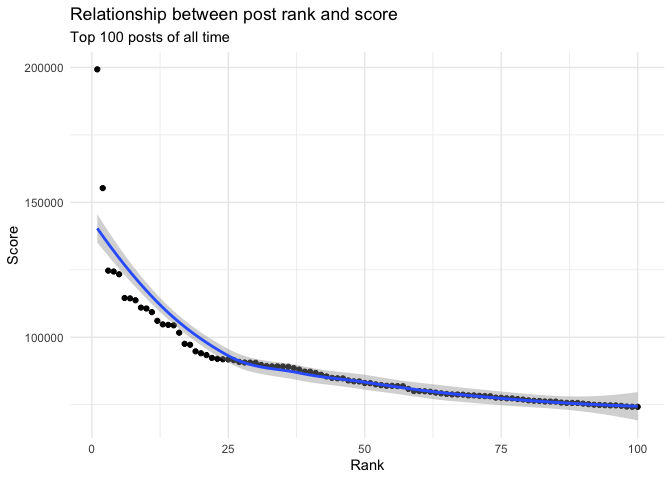<!-- -->

```r
year_clean %>% 
  ggplot(aes(x=year_rank, y = score)) +
  geom_point() +
  geom_smooth() +
    labs(
    title = "Relationship between post rank and score",
    subtitle = "Top 100 posts last year (2022)",
    x = "Rank",
    y = "Score"
  ) +
  theme_minimal()
```

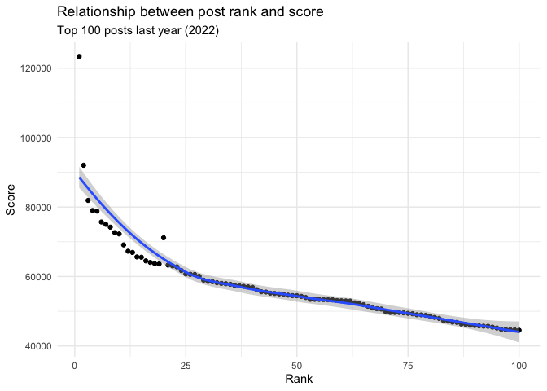<!-- -->

```r
month_clean %>% 
  ggplot(aes(x=month_rank, y = score)) +
  geom_point() +
  geom_smooth() +
    labs(
    title = "Relationship between post rank and score",
    subtitle = "Top 100 posts last month (December 2022)",
    x = "Rank",
    y = "Score"
  ) +
  theme_minimal()
```

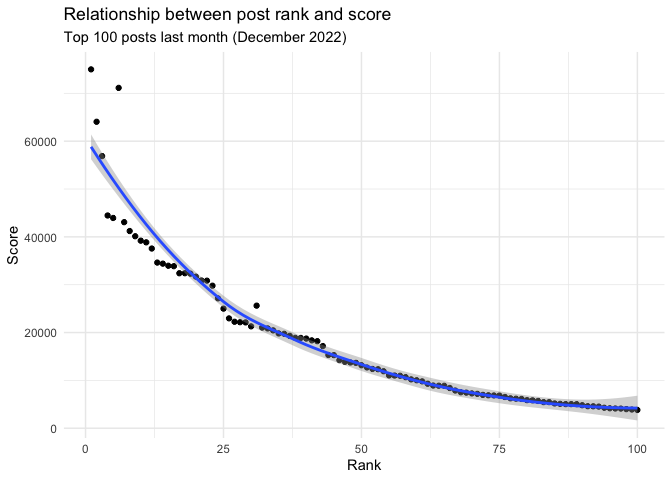<!-- -->

I investigated whether post rank scaled with upvote ratios. There are a few posts with very low upvote ratios (less than 75%), even though they also have very high scores. This indicates high engagement of users with both positive and negative opinions about the post. Effectively all of these posts are about contentious or divisive issues, and many are US-centric. Based on this finding I decided to focus my analysis on post topics and sources.


```r
# find post with very low upvote ratio
# all time
top_all %>% 
  filter(upvote_ratio < .75 ) %>% 
  arrange(upvote_ratio) %>% 
  select(c(post_title, flair, upvote_ratio, score, domain))
```

```
## # A tibble: 2 × 5
##   post_title                                          flair upvot…¹ score domain
##   <chr>                                               <chr>   <dbl> <dbl> <chr> 
## 1 The rise of comedy-news programs, like Jon Stewart… Neur…    0.71 80072 www.a…
## 2 [Megathread] World's most prestigious scientific p… News     0.72 80117 www.r…
## # … with abbreviated variable name ¹​upvote_ratio
```

```r
# past year
top_year %>% 
  filter(upvote_ratio < .75 ) %>% 
  arrange(upvote_ratio) %>% 
  select(c(post_title, flair, upvote_ratio, score, domain))
```

```
## # A tibble: 15 × 5
##    post_title                                         flair upvot…¹ score domain
##    <chr>                                              <chr>   <dbl> <dbl> <chr> 
##  1 "Ignorance of history may partly explain why Repu… Psyc…    0.61 49650 www.p…
##  2 "The Federal Assault Weapons Ban of 1994 signific… Heal…    0.62 64503 www.s…
##  3 "Gay and lesbian adults have higher COVID-19 vacc… Soci…    0.65 44733 www.g…
##  4 "Generation Z – those born after 1995 – overwhelm… Envi…    0.67 54488 www.s…
##  5 "Bitcoin mining is just as bad for the environmen… Envi…    0.7  58598 www.e…
##  6 "Data from 35 million traffic stops show that the… Soci…    0.7  57430 doi.o…
##  7 "Women in Congress are about 10% more likely to b… Soci…    0.7  54271 www.c…
##  8 "Since 2020, the US Supreme Court has become much… Soci…    0.7  52929 www.p…
##  9 "Covid vaccines prevented at least 330,000 deaths… Heal…    0.71 56201 www.h…
## 10 "Refugees are inaccurately portrayed as a drain o… Econ…    0.71 53082 doi.o…
## 11 "Neoliberalism, which calls for free-market capit… Psyc…    0.72 45161 www.e…
## 12 "In the US, 43.8% are consistently \"pro-choice\"… Soci…    0.73 60061 onlin…
## 13 "Half of Americans now think tackle football is n… Soci…    0.73 57023 news.…
## 14 "Most White Americans feel safe in interacting wi… Soci…    0.73 55178 onlin…
## 15 "Since the 1980s, incoming Republican administrat… Heal…    0.74 63060 www.p…
## # … with abbreviated variable name ¹​upvote_ratio
```

```r
# past month
top_month %>% 
  filter(upvote_ratio < .75 ) %>% 
  arrange(upvote_ratio) %>% 
  select(c(post_title, flair, upvote_ratio, score, domain))
```

```
## # A tibble: 4 × 5
##   post_title                                          flair upvot…¹ score domain
##   <chr>                                               <chr>   <dbl> <dbl> <chr> 
## 1 Pain relief from marijuana comes from a belief it … Medi…    0.67 18195 www.c…
## 2 Cannabis use is closely and causally associated wi… Medi…    0.69 10676 www.n…
## 3 Marijuana May Hurt Smokers More than Cigarettes Al… Heal…    0.7  11913 www.w…
## 4 Testosterone levels help explain why women tend to… Heal…    0.72 22254 www.p…
## # … with abbreviated variable name ¹​upvote_ratio
```


## Finding 1: Relationship between topic and post score

Three topics dominate the top-post lists: Psychology, Health, and Social Science. Together, these make up 51% of the top posts of all time (59% top month, 56% top year). 


```r
# all-time
by_flair_all <- top_all %>% 
  group_by(flair) %>% 
  summarize(count_id=n_distinct(id)) %>% 
  arrange(desc(count_id)) %>% 
  ggplot(aes(x = count_id, y=reorder(flair, count_id), fill=flair)) +
  geom_col(show.legend=FALSE) +
  gghighlight(count_id > 10) +
  labs(
    title = "Top r/science posts by topic",
    subtitle = "Top 100 posts of all time",
    x = "Number of Posts",
    y = "Topic"
  ) +
  theme_minimal()
by_flair_all
```

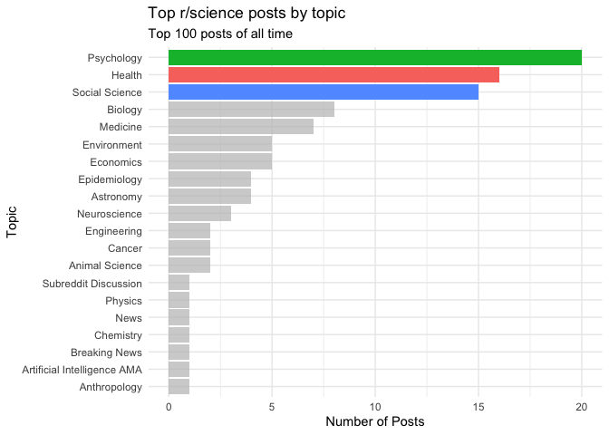<!-- -->

```r
# past year
by_flair_year <- top_year %>% 
  group_by(flair) %>% 
  summarize(count_id=n_distinct(id)) %>% 
  arrange(desc(count_id)) %>% 
  ggplot(aes(x = count_id, y=reorder(flair, count_id), fill=flair)) +
  geom_col(show.legend=FALSE) +
  scale_fill_brewer(palette = "BuGn") +
  gghighlight(count_id > 10) +
  labs(
    title = "Top r/science posts by topic",
    subtitle = "Top 100 posts last year (2022)",
    x = "Number of Posts",
    y = "Topic"
  ) +
  theme_minimal()
by_flair_year
```

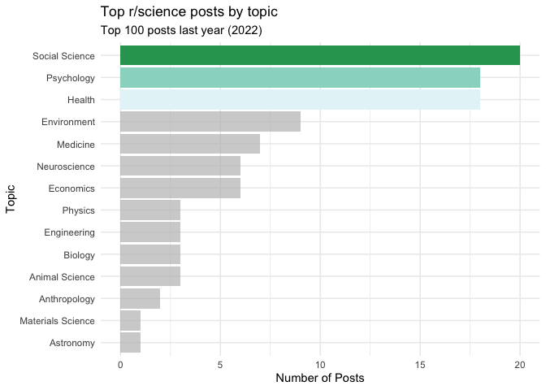<!-- -->

```r
# past month
by_flair_month <- top_month %>% 
  group_by(flair) %>% 
  summarize(count_id=n_distinct(id)) %>% 
  arrange(desc(count_id)) %>% 
  ggplot(aes(x = count_id, y=reorder(flair, count_id), fill=flair)) +
  geom_col(show.legend=FALSE) +
  gghighlight(count_id > 10) +
  scale_fill_brewer(palette = "BuPu", direction = -1) +
  labs(
    title = "Top r/science posts by topic",
    subtitle = "Top 100 posts last month (December 2022)",
    x = "Number of Posts",
    y = "Topic"
  ) +
  theme_minimal()
by_flair_month
```

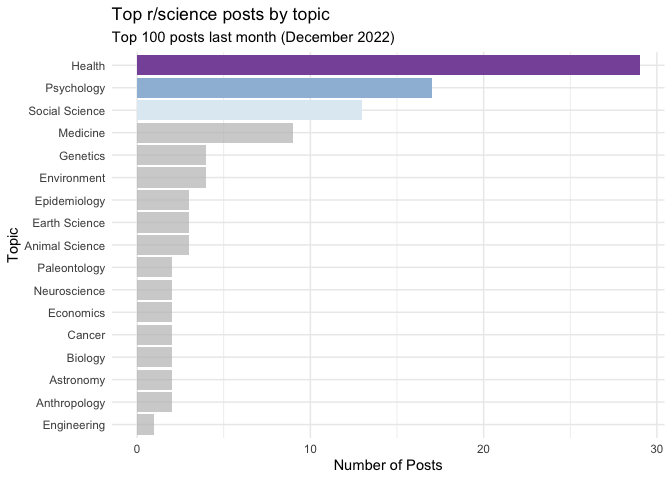<!-- -->

## Finding 2: Relationship between sources and post score

The posts come from 60+ source websites (identified by domain name, e.g. academictimes.com). For the all-time list, no source has more than 5 posts associated with it. However, in the past-year list, 14 unique posts come from psypost.org. In the past-month list, 17 posts come from psypost.org. This indicates a recent increase in the popularity of posts from this psypost.org in particular.


```r
# all-time
by_domain_all <- top_all %>% 
  group_by(domain) %>% 
  summarize(count_id=n_distinct(id)) %>% 
  arrange(desc(count_id)) %>% 
  head(10) %>% 
  ggplot(aes(x = count_id, y=reorder(domain, count_id), fill=domain)) +
  geom_col(show.legend=FALSE) +
  gghighlight(count_id > 10) +
  labs(
    title = "Most common sources for r/science posts",
    subtitle = "Top 100 posts of all time",
    x = "Number of Posts",
    y = "Topic"
  ) +
  theme_minimal()
by_domain_all
```

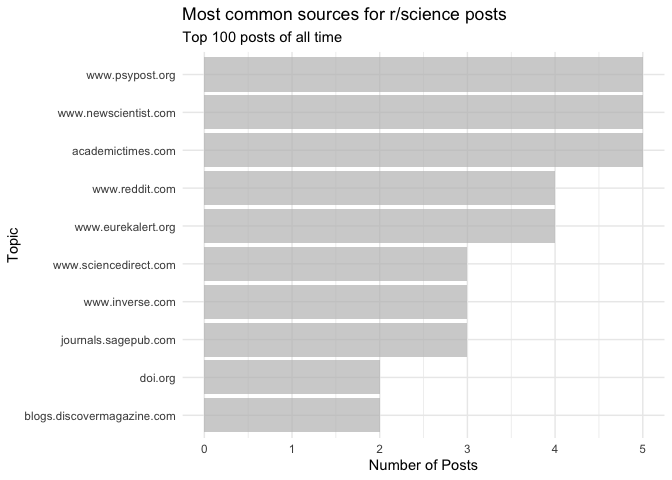<!-- -->

```r
# past year
by_domain_year <- top_year %>% 
  group_by(domain) %>% 
  summarize(count_id=n_distinct(id)) %>% 
  arrange(desc(count_id)) %>% 
  head(10) %>% 
  ggplot(aes(x = count_id, y=reorder(domain, count_id), fill=domain)) +
  geom_col(show.legend=FALSE) +
  scale_fill_brewer(palette = "Greens", direction = -1) +
  gghighlight(count_id > 10 ) +
  labs(
    title = "Most common sources for r/science posts",
    subtitle = "Top 100 posts last year (2022)",
    x = "Number of Posts",
    y = "Topic"
  ) +
  theme_minimal()
by_domain_year
```

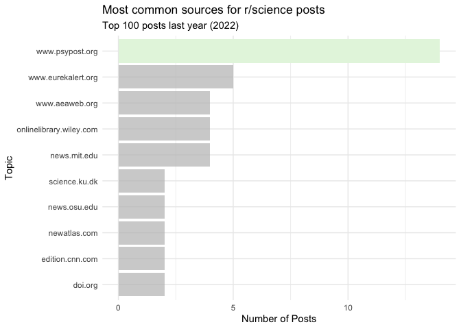<!-- -->

```r
# past month
by_domain_month <- top_month %>% 
  group_by(domain) %>% 
  summarize(count_id=n_distinct(id)) %>% 
  arrange(desc(count_id)) %>% 
  head(10) %>% 
  ggplot(aes(x = count_id, y=reorder(domain, count_id), fill=domain)) +
  geom_col(show.legend=FALSE) +
  gghighlight(count_id > 10) +
  scale_fill_brewer(palette = "PRGn") +
  labs(
    title = "Most common sources for r/science posts",
    subtitle = "Top 100 posts last month (December 2022)",
    x = "Number of Posts",
    y = "Topic"
  ) +
  theme_minimal()
by_domain_month
```

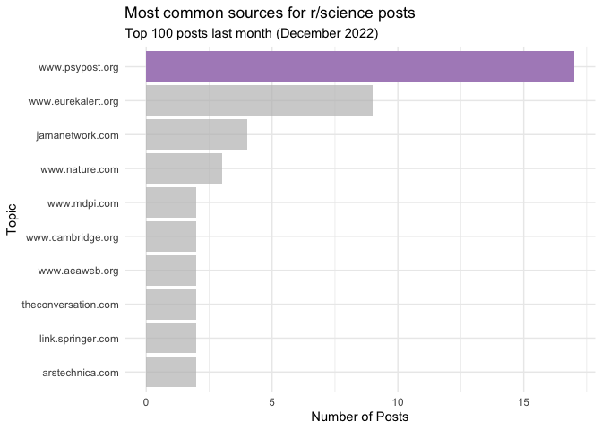<!-- -->

## Finding 3: Word frequency in post titles

I created wordclouds to show the most frequent words in the titles of the top posts of all time. The word "people" appeared 12 times, "children" appeared 8 times, "sex" appeared 8 times, "life" appeared 7 times, and "U.S." appeared 6 times.


```r
all_words <- text_all_clean %>% count(word, sort=TRUE)
wordcloud2(all_words, size = 1.6)
```

```{=html}
<div class="wordcloud2 html-widget html-fill-item-overflow-hidden html-fill-item" id="htmlwidget-583892e1ce5dca4d00dc" style="width:672px;height:480px;"></div>
<script type="application/json" data-for="htmlwidget-583892e1ce5dca4d00dc">{"x":{"word":["people","human","children","covid","sex","students","time","cannabis","life","administration","adults","health","marijuana","parents","percent","sleep","vaccine","cancer","crime","lead","pain","programs","reduced","social","u.s","water","birth","concrete","consumers","cost","country’s","create","growth","incarceration","income","increase","led","private","rates","significantly","suicide","times","united","university","age","airlines","black","brain","change","chose","coronavirus","costs","cut","developed","drinking","drop","due","elite","elk","evidence","expectancy","experience","facilities","findings","food","half","home","hour","hpv","humans","increased","junk","lives","obama","oils","pandemic","prisons","public","quality","rapid","recreational","response","safe","save","schools","significant","stephen","stress","suicides","taxes","team","tomatoes","trees","trump","view","woman","women","youth","abstinence","aged","ages","aging","alive","altruism","ama","american","americans","artery","australia","belief","believed","binghamton","bottom","breast","butts","calls","care","cash","cells","cement","cheaper","chemical","chronic","cigarette","class","clean","climate","college","common","compared","contribute","corals","corporations","counties","countries","cows","cracks","decline","depression","desire","developing","difference","discover","discovered","discovery","dogs","don’t","enforcement","essential","experienced","experiences","experiment","exploration","female","flavor","free","freeload","function","future","games","gene","giving","hair","happier","hard","hawking","healing","hole","hunting","impact","including","individuals","industrial","insulin","invasive","journal","kids","kill","law","leading","legal","legalization","legalized","length","lies","light","local","material","methane","mice","military","million","minutes","move","multiple","naming","natural","news","night","obesity","olds","passion","performance","philanthropy","physicist","plant","poor","posts","pregnancy","production","psilocybin","published","punish","quickly","reasons","reduce","reducing","regular","relationship","replaced","reported","rest","rising","root","safety","school","scientific","screen","season","seizure","seizures","severe","sexual","share","sleepiness","socially","solar","species","spent","stanford","star","street","stripes","strong","substantially","successfully","suggesting","support","system","teens","term","tests","theory","thin","tree","type","unwanted","urine","video","violent","washington","waste","wealthy","weeks","white","win","york","1.13","1.4","10,000","100,000","130,000","15.7","1990s","28.9","336,000","4.5","5.5","50,000","55,000","68,000","7.3","77.48","99.9","academic","accelerated","access","accounting","accuracy","ace2","acidity","acquired","act","actual","acute","addictive","adolescents","advertised","affected","agent","aggressive","ai","air","alcoholics","alleviate","america","amounts","amplifying","anaesthesia","analysis","analytical","analyzing","animals","annually","anxiety","appears","approached","april","argument","arrive","arrived","articles","aspirin","astrophysics","attached","attitudes","attraction","attractive","australian","autism","avoid","awareness","babies","backgrounds","bars","based","basis","bay","beast","bee","begins","behaviour","benign","billion","binge","biomass","biopsy","biosensor","bird","birthweight","biting","blades","bland","blobs","body","books","born","bought","boys","bring","british","bump","burden","burning","burns","butchered","calcium","called","can’t","cancers","candidates","capita","car","carbon","carbonate","cardiology","caring","carry","cars","casual","causal","caused","cavity","centers","cents","challenges","cheaply","chemotherapy","chief","child’s","childhood","china","cinder","circumference","claimed","classes","clearance","clinical","close","coaxed","colbert","collar","colombia","colorado","combined","comedy","commissioned","commit","commuting","companies","compliance","complicity","component","computer","condition","conditioning","condoms","confirms","confront","connection","conscious","consume","content","continued","contradict","contrast","control","cooking","coronaviruses","counter","counterparts","country","crack","creates","creative","creativity","credited","crimes","criminals","criteria","critiques","crows","cruise","cruising","crushing","cuts","cycles","cytokine","daily","dangerous","data","daytime","dead","dealers","death","deaths","deciding","decisions","declined","definitively","delaying","democratic","democrats","demonstrate","depreciation","deprivation","deprived","derived","desalinate","designed","desirable","destroy","deter","determine","development","diabetes","diagnoses","diagnosing","didn’t","died","dies","disadvantaged","disappearance","disaster","discovers","disease","dish","dislike","dismantle","disorder","dispensaries","disproportionately","distinction","doesn’t","dog","dollar","domesticated","door","dormant","dredging","drive","driven","driving","drug","drugs","dug","duration","dwarf","dwr","dye","earned","earth","earth’s","eating","economic","ed","education","effective","efficient","efficiently","electricity","eliminate","elimination","emissions","employee","employees","encounter","engineers","enjoyment","enter","environment","epa","epidemiologists","equipment","equipped","era","escobar's","establishes","estimate","ethics","exclusion","exercise","exhaustion","exist","existing","expected","explore","exposes","express","extra","extremely","eyes","facebook","facilitate","factor","falling","family","fares","fashion","faster","favorable","feels","fees","fewer","fields","fight","filtration","financial","firms","flesh","flexibility","flies","fmri","focus","footprint","forests","form","formed","forming","fortune","frailty","framing","france","fraud","frequency","frequent","friends","fundamental","funding","fungi","fungus","gain","galaxy","gallons","game","gaming","gases","generating","genital","germany","germinate","germination","gestational","global","gold","goodwill","google","government","governors","grades","graduate","greatly","greenhouses","grow","grown","hawaii’s","head","heal","heals","healthcare","healthy","heard","hearing","heat","helpline","heterosexual","hiding","hippos","history","hobbies","honeybees","hook","hope","hopkins","hormones","hours","house","hrsace2","humor","hungry","hunters","hurting","husk","ice","ills","immune","impairs","improve","improved","improvement","incarcerate","incentives","increasing","indoor","induced","induces","industry","inequality","inevitable","inexpensive","infancy","inflammation","inflammatory","inform","ingestion","inhalation","initiate","initiative","injuries","injury","inoculate","insects","installed","institutions","intelligence","intentionally","interconnected","intergenerational","interrupted","intrusions","intrusive","involving","issue","issuing","jails","japan","japanese","john","johns","join","jon","jumped","juvenile","kāne’ohe","kilogram","kingdom","korean","lab","lancet","land","landing","landowners","lands","largest","larks","laws","learn","leaving","leds","legalizing","lengthened","levels","licensed","lifestyle","lights","limestone","limit","limits","line","lines","linings","link","linked","linking","litter","littered","living","lock","lockdown","logic's","losing","lost","low","lower","lsd","lungs","m87","main","maintenance","majority","makes","mammals","mandatory","manifestation","manipulative","margins","marketers","marketing","mars","mass","massive","mastodon","matter","medical","medicare","megathread","memories","men's","mentality","met","meta","microevolution","middle","milestone","militarization","minds","minors","minute","misaligned","misrepresent","miss","missing","mixed","mmr","models","modern","molecules","money","month","moon","morally","morbidity","morning","motivate","mouse","moved","moving","mrna","mutant","nasa","nasal","nation’s","naturally","nearby","negative","neighbouring","neonatal","netflix","nets","neuroimaging","normal","noticing","numerous","obese","offer","office","oliver","oneself","ongoing","online","opioid","opioids","orbiting","organizations","origins","osha","outcome","outcomes","outdoors","overestimate","owls","pablo","painted","painting","paleontologists","park","parking","partner","pass","patient","pay","paying","peers","perceived","period","periods","permanent","perseverance","personalized","phenomenon","physical","pick","picture","planet","planets","planning","players","plays","plentiful","police","policy","politics","ponder","population","position","positive","potential","powered","powerful","practice","practices","precipitate","precise","precision","prepared","prescription","presence","president","press","prestigious","prevention","prices","pride","prison","privileged","process","processes","produce","produces","products","profiles","profits","progress","prohibited","proof","prostate","protect","province","psychedelic","publications","purchases","pursuit","quarter","rags","raising","random","rapidly","read","reason","rebel","receive","recombinant","recommended","reddit","redditors","reduction","reductions","reef","regulations","release","releases","relevant","relief","relieves","relieving","rely","remember","reminders","reminiscence","repeatedly","repetitive","replaces","represent","republican","require","required","requires","resistant","respect","respond","restaurants","restored","result","resulting","results","retail","rethink","returned","revenue","reversing","rewards","rice","riches","rise","risk","role","rubber","rudimentary","sand","satisfied","saved","scarring","schedule","scholars","science","seals","search","seattle","section","sending","sensitive","sensor","sentencing","series","serum","services","serving","sets","severely","sewage","shaming","shape","shift","shoot","shorten","shredding","shrink","shrinking","shutdown","shutting","signals","silica","silver","simple","simply","simulated","single","singles","sized","skeleton","sleeping","smelling","snack","soared","sole","soluble","song","sources","specific","spend","spending","spends","spews","spiked","spores","standard","stark","start","started","stay","stewart","stiffening","stop","stopping","store","story","straighteners","stranger","strings","struggling","stump","stumps","subsequently","success","successful","suggest","super","supercorals","supermassive","superorganisms","supervisors","supporting","supposed","suppression","suppressions","surface","surplus","survey","susceptible","sustainable","swiftly","systematically","systems","takes","taking","talk","tapping","taste","tasty","taxpayer","teach","tear","technique","technological","technology","teen","teenage","teeth","temperatures","temps","test","testing","texas","theoretical","therapy","they’re","thirds","thriving","tissue","tolerated","topical","town","treat","treated","treatment","treatments","trending","trends","trial","trials","trillion","trusted","tumour","tumours","turbine","typically","uk","ultracool","uncover","underestimated","understanding","understudied","unemployment","unions","unlocks","unprecedented","unprotected","unsuccessful","upend","upfront","upward","usa","usual","utah's","utilization","utilized","uv","valued","varieties","vast","vastly","venom","venom's","violate","virus","vote","warts","we’ve","weaken","wealth","weapons","wear","weed","weekly","wind","wisdom","withholding","withstood","workday","workforce","world's","yale","zealanders","zebras"],"freq":[12,10,8,8,8,8,8,7,7,6,6,6,6,6,6,6,6,5,5,5,5,5,5,5,5,5,4,4,4,4,4,4,4,4,4,4,4,4,4,4,4,4,4,4,3,3,3,3,3,3,3,3,3,3,3,3,3,3,3,3,3,3,3,3,3,3,3,3,3,3,3,3,3,3,3,3,3,3,3,3,3,3,3,3,3,3,3,3,3,3,3,3,3,3,3,3,3,3,2,2,2,2,2,2,2,2,2,2,2,2,2,2,2,2,2,2,2,2,2,2,2,2,2,2,2,2,2,2,2,2,2,2,2,2,2,2,2,2,2,2,2,2,2,2,2,2,2,2,2,2,2,2,2,2,2,2,2,2,2,2,2,2,2,2,2,2,2,2,2,2,2,2,2,2,2,2,2,2,2,2,2,2,2,2,2,2,2,2,2,2,2,2,2,2,2,2,2,2,2,2,2,2,2,2,2,2,2,2,2,2,2,2,2,2,2,2,2,2,2,2,2,2,2,2,2,2,2,2,2,2,2,2,2,2,2,2,2,2,2,2,2,2,2,2,2,2,2,2,2,2,2,2,2,2,2,2,2,2,2,2,2,2,2,2,2,2,2,1,1,1,1,1,1,1,1,1,1,1,1,1,1,1,1,1,1,1,1,1,1,1,1,1,1,1,1,1,1,1,1,1,1,1,1,1,1,1,1,1,1,1,1,1,1,1,1,1,1,1,1,1,1,1,1,1,1,1,1,1,1,1,1,1,1,1,1,1,1,1,1,1,1,1,1,1,1,1,1,1,1,1,1,1,1,1,1,1,1,1,1,1,1,1,1,1,1,1,1,1,1,1,1,1,1,1,1,1,1,1,1,1,1,1,1,1,1,1,1,1,1,1,1,1,1,1,1,1,1,1,1,1,1,1,1,1,1,1,1,1,1,1,1,1,1,1,1,1,1,1,1,1,1,1,1,1,1,1,1,1,1,1,1,1,1,1,1,1,1,1,1,1,1,1,1,1,1,1,1,1,1,1,1,1,1,1,1,1,1,1,1,1,1,1,1,1,1,1,1,1,1,1,1,1,1,1,1,1,1,1,1,1,1,1,1,1,1,1,1,1,1,1,1,1,1,1,1,1,1,1,1,1,1,1,1,1,1,1,1,1,1,1,1,1,1,1,1,1,1,1,1,1,1,1,1,1,1,1,1,1,1,1,1,1,1,1,1,1,1,1,1,1,1,1,1,1,1,1,1,1,1,1,1,1,1,1,1,1,1,1,1,1,1,1,1,1,1,1,1,1,1,1,1,1,1,1,1,1,1,1,1,1,1,1,1,1,1,1,1,1,1,1,1,1,1,1,1,1,1,1,1,1,1,1,1,1,1,1,1,1,1,1,1,1,1,1,1,1,1,1,1,1,1,1,1,1,1,1,1,1,1,1,1,1,1,1,1,1,1,1,1,1,1,1,1,1,1,1,1,1,1,1,1,1,1,1,1,1,1,1,1,1,1,1,1,1,1,1,1,1,1,1,1,1,1,1,1,1,1,1,1,1,1,1,1,1,1,1,1,1,1,1,1,1,1,1,1,1,1,1,1,1,1,1,1,1,1,1,1,1,1,1,1,1,1,1,1,1,1,1,1,1,1,1,1,1,1,1,1,1,1,1,1,1,1,1,1,1,1,1,1,1,1,1,1,1,1,1,1,1,1,1,1,1,1,1,1,1,1,1,1,1,1,1,1,1,1,1,1,1,1,1,1,1,1,1,1,1,1,1,1,1,1,1,1,1,1,1,1,1,1,1,1,1,1,1,1,1,1,1,1,1,1,1,1,1,1,1,1,1,1,1,1,1,1,1,1,1,1,1,1,1,1,1,1,1,1,1,1,1,1,1,1,1,1,1,1,1,1,1,1,1,1,1,1,1,1,1,1,1,1,1,1,1,1,1,1,1,1,1,1,1,1,1,1,1,1,1,1,1,1,1,1,1,1,1,1,1,1,1,1,1,1,1,1,1,1,1,1,1,1,1,1,1,1,1,1,1,1,1,1,1,1,1,1,1,1,1,1,1,1,1,1,1,1,1,1,1,1,1,1,1,1,1,1,1,1,1,1,1,1,1,1,1,1,1,1,1,1,1,1,1,1,1,1,1,1,1,1,1,1,1,1,1,1,1,1,1,1,1,1,1,1,1,1,1,1,1,1,1,1,1,1,1,1,1,1,1,1,1,1,1,1,1,1,1,1,1,1,1,1,1,1,1,1,1,1,1,1,1,1,1,1,1,1,1,1,1,1,1,1,1,1,1,1,1,1,1,1,1,1,1,1,1,1,1,1,1,1,1,1,1,1,1,1,1,1,1,1,1,1,1,1,1,1,1,1,1,1,1,1,1,1,1,1,1,1,1,1,1,1,1,1,1,1,1,1,1,1,1,1,1,1,1,1,1,1,1,1,1,1,1,1,1,1,1,1,1,1,1,1,1,1,1,1,1,1,1,1,1,1,1,1,1,1,1,1,1,1,1,1,1,1,1,1,1,1,1,1,1,1,1,1,1,1,1,1,1,1,1,1,1,1,1,1,1],"fontFamily":"Segoe UI","fontWeight":"bold","color":"random-dark","minSize":0,"weightFactor":24,"backgroundColor":"white","gridSize":0,"minRotation":-0.785398163397448,"maxRotation":0.785398163397448,"shuffle":true,"rotateRatio":0.4,"shape":"circle","ellipticity":0.65,"figBase64":null,"hover":null},"evals":[],"jsHooks":{"render":[{"code":"function(el,x){\n                        console.log(123);\n                        if(!iii){\n                          window.location.reload();\n                          iii = False;\n\n                        }\n  }","data":null}]}}</script>
```


The past-year word list represents more recent trends on the subreddit. The word "black" appeared 8 times, "woman" appeared 8 times, and "lung" appeared 7 times.

```r
year_words <- text_year_clean %>% count(word, sort=TRUE)
wordcloud2(year_words, size = 1.6, color = (c("green","blue")))
```

```{=html}
<div class="wordcloud2 html-widget html-fill-item-overflow-hidden html-fill-item" id="htmlwidget-5ba67d7c3524a3ecccdd" style="width:672px;height:480px;"></div>
<script type="application/json" data-for="htmlwidget-5ba67d7c3524a3ecccdd">{"x":{"word":["people","black","covid","americans","women","increased","lungs","rates","adults","billion","students","calls","children","climate","global","linked","lower","public","social","speed","symptoms","term","age","brains","cats","effect","half","homes","lives","names","news","online","results","support","tests","time","united","abortion","actual","air","alaska","american","anti","average","cancer","cannabis","change","cognitive","consistently","consumption","cost","data","deaths","depression","diet","elk","explain","form","games","healthy","hole","hour","human","humans","income","inequality","issues","kids","led","life","light","material","memory","mice","million","months","negative","parents","pigs","pollution","poor","poverty","private","profit","provide","record","regular","relationships","safe","saved","sex","sexual","traffic","tv","vaccine","video","watching","water","youth","1.5","ability","abuse","aging","alcohol","alzheimer’s","antibodies","auditory","babies","battery","benefit","biologically","block","born","brain","breath","bulb","care","cash","caused","cells","childhood","chip","chores","classes","close","coffers","college","common","compared","costs","cov","create","crime","damages","decade","decades","dependent","design","desire","developed","dimensional","discovered","disease","dogs","drinking","driver","dropout","drugs","economic","economy","emotions","endure","engagement","engineers","excessive","expected","experiment","exposure","family","fast","feel","female","findings","firms","food","football","footprint","friend","fund","funding","girls","giving","governments","greta","history","home","horses","hospitalizations","household","humidities","hunting","identifies","immigrants","impact","impair","increase","increases","increasing","infants","information","insulin","interrupted","jewish","killing","leading","level","levels","market","means","media","medical","medicare","microplastics","mit","mobility","model","mortality","moving","nanoparticles","normal","norwegian","offer","oil","pandemic","paralyzed","passed","past","performance","permanent","planning","plastic","platform","playing","police","policy","political","popular","positive","previous","previously","pro","probability","process","programs","quality","raised","recently","recipients","reduce","reduction","reported","residents","resistant","result","revealed","reveals","salt","sars","season","services","significant","significantly","skills","spending","stanford","started","suffering","suicide","suicides","switched","system","teen","temperature","temperatures","tend","test","thunberg","times","tinnitus","tobacco","total","trap","treatment","u.s","unwanted","upward","vaccination","vaccines","views","voices","walk","wet","white","world","worse","1.84","10,000","102,865","11,314","14.8","1980s","2,000","2.0","3.6","330,000","40s","43.8","5.5","5.74","50,000","50s","60s","700,000","9.1","99.9","academic","accelerated","accounting","achieved","achieving","acoustic","act","active","activist","activities","activity","adding","addition","additional","administrations","admissions","adult","advance","advanced","adverse","affairs","affected","affiliations","african","aged","ages","ago","aiming","airborne","airflow","alaskan","allocated","aluminum","alzheimer's","ambitious","america","amid","amy","analysis","ancient","animals","anticipate","antipoverty","anxiety","anxious","appointment","approximately","argument","artery","articulate","artificial","assault","assembles","ate","attitudes","attractive","auriculotemporal","australians","avoids","bad","balanced","ban","barrett","basis","behavior","behavioral","behaviors","belief","benefits","bigger","biological","biology","biomarkers","birds","birth","births","bitcoin","blacks","bladder","blocks","blood","boost","boosts","boredom","boys","break","breaking","breastfed","brett","bring","broad","build","building","buildings","burglarized","buried","burning","buying","campaign","canals","candidate","canines","capabilities","capital","capitalism","carbon","career","celebrities","celebrity","celibacy","chains","chance","charged","charging","chemical","child","childless","choice","christians","cigarettes","circumstances","cite","citizens","civic","claims","clinical","closely","cnn","cohorts","coin","collaboration","colourful","combed","combining","commissioned","committees","companies","compensate","completely","concept","concern","condition","conditions","coney","conference","confirm","confirmed","congress","conservatism","conservative","conservatives","consume","consumer","consuming","contact","context","contradicts","contrary","contributing","control","conventioneers","conventions","convinced","copenhagen","cord","coronavirus","correct","correlate","counseling","counterparts","country","court","court's","court’s","created","creative","creativity","crisis","cross","cuban's","current","curtails","daily","damage","day","days","deciding","decline","decode","decrease","deforestation","delivered","demand","demands","dementia","democracies","democrats","deniers","designed","detect","detected","detection","developing","diabetes","diagnosis","die","died","direct","disappeared","discouraging","discussing","disinterest","displayed","disproven","distinguish","divergence","dividend","dog","don’t","dorm","doses","double","drain","dream","drilling","drivers","driving","drop","droughts","drug","due","dwindles","dwr","earlier","earned","easily","eat","eating","ecosystems","education","educational","effective","efficacy","eggs","electoral","electric","eliminate","elimination","emission","emissions","employment","endorsing","enrollment","entire","environment","equal","equity","escape","estimated","europe","evident","exams","exceeded","exception","executive","existential","expenditures","experience","experienced","exposing","express","extended","extension","extent","extincted","extract","extreme","facial","facility","failures","familiar","famine","fatherhood","favor","feared","federal","federally","feeling","fell","fellow","fewer","field","filter","fire","firearm","fish","flag","flightless","fluid","fluke","flung","focusing","foetus","foreign","formed","fossil","founding","frailty","free","french","frequently","freshwater","friendships","fuel","fuels","functioning","functions","fundamental","funded","gains","gathered","gay","gender","gene","generation","generic","giant","goals","gpa","grades","graduate","growing","grunts","guidance","hangover","happened","happy","harming","health","heard","hearing","heat","helpline","helps","heterosexual","hiding","hiv","holes","homicides","hope","hostility","hours","house","housework","huge","humanity","humidity","humorous","hunters","hurt","hybrid","identifying","ignorance","immediately","immune","immunity","implants","improve","improved","improvement","improves","improving","impulse","inaccurately","incidence","including","incoming","incontrovertibly","india","indicating","indoor","infected","infection","inflated","inhaled","inhaling","initial","injection","inspiration","instability","instructions","integrative","intelligence","intend","intention","interacting","international","internet","internet's","interracial","intervals","involved","involving","isolation","it’s","japanese","jobs","journal","justice","justified","kavanaugh","kg","kick","kill","killed","kilometers","knowing","kras","lab","labor","laboratory","lack","lakes","land","landowners","lands","larger","lasting","lasts","leaded","learn","learning","leaving","lecture","legalization","legumes","lesbian","limit","limited","lingering","listed","live","liver","livestock","load","logic's","low","lowered","lowest","manufactured","margins","marijuana","mark","marked","mass","materials","maternal","matter","matters","maturity","maximum","measures","meat","median","medicine","mediterranean","meetings","melon","memes","mental","microbes","microdosing","middle","midlife","millions","mined","mining","minutes","mired","misfolded","molecular","mothers","moved","myrkl","myths","nanoplastics","narrative","nascar","native","nature","negatively","neglect","neighborhood","neoliberalism","nerve","nerves","newly","north","nuclear","nursing","nuts","objectification","observed","obsessed","occur","occurred","offers","officers","oily","olds","olive","oneself","operations","optimal","organizations","organs","orgasm","original","outcome","outcomes","overwhelmingly","owned","oxygen","paralysis","particles","partly","partner","passive","patient","patients","patrols","pcr","peculiar","peers","people’s","perceive","percent","percentage","performed","performing","period","person","petabits","pharmacy","photonic","physical","physicist","piercings","pig","pill","placenta","plants","play","played","polymer","polymers","populations","pornography","portrayed","position","positively","possibly","postsecondary","potentially","powering","pre","predictor","preference","preferred","pregnancies","pregnancy","presidential","prevalence","prevented","prevents","principally","prior","processing","produced","product","professional","prolonged","promising","prospects","protection","protein","proteins","proved","psilocybin","published","purchase","quantities","races","racetracks","racism","rags","rallies","rally","randomly","rape","rate","raw","reach","ready","real","recall","received","recognize","recordings","redistribution","reduced","reduces","reform","refugee","refugees","region","regressive","regulation","related","relative","relatives","release","relevant","religiosity","remain","remembering","removal","renovations","repeated","report","reporting","republican","republicans","requiring","resilient","resistance","resources","respiratory","respondents","resulted","resulting","retaining","reversing","revision","rhetoric","rich","riches","risk","rivers","road","robbed","role","roles","salaries","salinization","sand","satisfied","scales","school","schools","science","score","scores","scrap","security","seeds","senate","sensor","separate","serve","sesame","sexism","share","sharp","sheets","shift","shifting","shown","shredding","signal","single","sized","slow","smoke","sniff","soared","socioeconomic","solving","song","sounds","source","south","speak","species","specific","speech","spent","spews","spinal","springing","squirting","stages","star","start","status","steel","stereotypes","stiffening","stimulation","stop","stopped","stops","strain","strategy","stress","striking","stroll","stronger","strongest","subjects","substances","substantially","sufferers","suggest","sulfur","supply","supreme","surgery","survey","sweeteners","switch","switching","tackle","targeted","tasks","tattoos","taxation","teacher","team","teens","terms","they’re","thousands","threat","tiny","top","tract","traditional","traditionalist","trained","transfer","transfers","translate","transmission","transmit","treatments","trial","trimester","trump","trust","twenty","type","ucsf","ultraviolet","underestimate","undergoing","understand","unequal","unexpectedly","universe","universities","university","unleaded","unlike","unprovoked","unraveling","unresponsive","unsalted","upbringing","usual","utah's","vaccinated","values","variants","vaxxers","vegetables","vehicles","victims","volunteers","votes","walkers","war","waste","waves","we’ve","weapons","wholegrains","wild","wildfire","womb","women's","won","worshiping","yearly","zoomed","zooplankton"],"freq":[11,10,10,9,8,7,7,7,6,6,6,5,5,5,5,5,5,5,5,5,5,5,4,4,4,4,4,4,4,4,4,4,4,4,4,4,4,3,3,3,3,3,3,3,3,3,3,3,3,3,3,3,3,3,3,3,3,3,3,3,3,3,3,3,3,3,3,3,3,3,3,3,3,3,3,3,3,3,3,3,3,3,3,3,3,3,3,3,3,3,3,3,3,3,3,3,3,3,3,2,2,2,2,2,2,2,2,2,2,2,2,2,2,2,2,2,2,2,2,2,2,2,2,2,2,2,2,2,2,2,2,2,2,2,2,2,2,2,2,2,2,2,2,2,2,2,2,2,2,2,2,2,2,2,2,2,2,2,2,2,2,2,2,2,2,2,2,2,2,2,2,2,2,2,2,2,2,2,2,2,2,2,2,2,2,2,2,2,2,2,2,2,2,2,2,2,2,2,2,2,2,2,2,2,2,2,2,2,2,2,2,2,2,2,2,2,2,2,2,2,2,2,2,2,2,2,2,2,2,2,2,2,2,2,2,2,2,2,2,2,2,2,2,2,2,2,2,2,2,2,2,2,2,2,2,2,2,2,2,2,2,2,2,2,2,2,2,2,2,2,2,2,2,2,2,2,2,2,2,2,2,2,2,2,2,1,1,1,1,1,1,1,1,1,1,1,1,1,1,1,1,1,1,1,1,1,1,1,1,1,1,1,1,1,1,1,1,1,1,1,1,1,1,1,1,1,1,1,1,1,1,1,1,1,1,1,1,1,1,1,1,1,1,1,1,1,1,1,1,1,1,1,1,1,1,1,1,1,1,1,1,1,1,1,1,1,1,1,1,1,1,1,1,1,1,1,1,1,1,1,1,1,1,1,1,1,1,1,1,1,1,1,1,1,1,1,1,1,1,1,1,1,1,1,1,1,1,1,1,1,1,1,1,1,1,1,1,1,1,1,1,1,1,1,1,1,1,1,1,1,1,1,1,1,1,1,1,1,1,1,1,1,1,1,1,1,1,1,1,1,1,1,1,1,1,1,1,1,1,1,1,1,1,1,1,1,1,1,1,1,1,1,1,1,1,1,1,1,1,1,1,1,1,1,1,1,1,1,1,1,1,1,1,1,1,1,1,1,1,1,1,1,1,1,1,1,1,1,1,1,1,1,1,1,1,1,1,1,1,1,1,1,1,1,1,1,1,1,1,1,1,1,1,1,1,1,1,1,1,1,1,1,1,1,1,1,1,1,1,1,1,1,1,1,1,1,1,1,1,1,1,1,1,1,1,1,1,1,1,1,1,1,1,1,1,1,1,1,1,1,1,1,1,1,1,1,1,1,1,1,1,1,1,1,1,1,1,1,1,1,1,1,1,1,1,1,1,1,1,1,1,1,1,1,1,1,1,1,1,1,1,1,1,1,1,1,1,1,1,1,1,1,1,1,1,1,1,1,1,1,1,1,1,1,1,1,1,1,1,1,1,1,1,1,1,1,1,1,1,1,1,1,1,1,1,1,1,1,1,1,1,1,1,1,1,1,1,1,1,1,1,1,1,1,1,1,1,1,1,1,1,1,1,1,1,1,1,1,1,1,1,1,1,1,1,1,1,1,1,1,1,1,1,1,1,1,1,1,1,1,1,1,1,1,1,1,1,1,1,1,1,1,1,1,1,1,1,1,1,1,1,1,1,1,1,1,1,1,1,1,1,1,1,1,1,1,1,1,1,1,1,1,1,1,1,1,1,1,1,1,1,1,1,1,1,1,1,1,1,1,1,1,1,1,1,1,1,1,1,1,1,1,1,1,1,1,1,1,1,1,1,1,1,1,1,1,1,1,1,1,1,1,1,1,1,1,1,1,1,1,1,1,1,1,1,1,1,1,1,1,1,1,1,1,1,1,1,1,1,1,1,1,1,1,1,1,1,1,1,1,1,1,1,1,1,1,1,1,1,1,1,1,1,1,1,1,1,1,1,1,1,1,1,1,1,1,1,1,1,1,1,1,1,1,1,1,1,1,1,1,1,1,1,1,1,1,1,1,1,1,1,1,1,1,1,1,1,1,1,1,1,1,1,1,1,1,1,1,1,1,1,1,1,1,1,1,1,1,1,1,1,1,1,1,1,1,1,1,1,1,1,1,1,1,1,1,1,1,1,1,1,1,1,1,1,1,1,1,1,1,1,1,1,1,1,1,1,1,1,1,1,1,1,1,1,1,1,1,1,1,1,1,1,1,1,1,1,1,1,1,1,1,1,1,1,1,1,1,1,1,1,1,1,1,1,1,1,1,1,1,1,1,1,1,1,1,1,1,1,1,1,1,1,1,1,1,1,1,1,1,1,1,1,1,1,1,1,1,1,1,1,1,1,1,1,1,1,1,1,1,1,1,1,1,1,1,1,1,1,1,1,1,1,1,1,1,1,1,1,1,1,1,1,1,1,1,1,1,1,1,1,1,1,1,1,1,1,1,1,1,1,1,1,1,1,1,1,1,1,1,1,1,1,1,1,1,1,1,1,1,1],"fontFamily":"Segoe UI","fontWeight":"bold","color":["green","blue"],"minSize":0,"weightFactor":26.1818181818182,"backgroundColor":"white","gridSize":0,"minRotation":-0.785398163397448,"maxRotation":0.785398163397448,"shuffle":true,"rotateRatio":0.4,"shape":"circle","ellipticity":0.65,"figBase64":null,"hover":null},"evals":[],"jsHooks":{"render":[{"code":"function(el,x){\n                        console.log(123);\n                        if(!iii){\n                          window.location.reload();\n                          iii = False;\n\n                        }\n  }","data":null}]}}</script>
```

The past-year month list resembles the past-year list.


```r
month_words <- text_month_clean %>% count(word, sort=TRUE)
wordcloud2(year_words, size = 1.6, color = (c("purple","blue")))
```

```{=html}
<div class="wordcloud2 html-widget html-fill-item-overflow-hidden html-fill-item" id="htmlwidget-10258e08359766e2235d" style="width:672px;height:480px;"></div>
<script type="application/json" data-for="htmlwidget-10258e08359766e2235d">{"x":{"word":["people","black","covid","americans","women","increased","lungs","rates","adults","billion","students","calls","children","climate","global","linked","lower","public","social","speed","symptoms","term","age","brains","cats","effect","half","homes","lives","names","news","online","results","support","tests","time","united","abortion","actual","air","alaska","american","anti","average","cancer","cannabis","change","cognitive","consistently","consumption","cost","data","deaths","depression","diet","elk","explain","form","games","healthy","hole","hour","human","humans","income","inequality","issues","kids","led","life","light","material","memory","mice","million","months","negative","parents","pigs","pollution","poor","poverty","private","profit","provide","record","regular","relationships","safe","saved","sex","sexual","traffic","tv","vaccine","video","watching","water","youth","1.5","ability","abuse","aging","alcohol","alzheimer’s","antibodies","auditory","babies","battery","benefit","biologically","block","born","brain","breath","bulb","care","cash","caused","cells","childhood","chip","chores","classes","close","coffers","college","common","compared","costs","cov","create","crime","damages","decade","decades","dependent","design","desire","developed","dimensional","discovered","disease","dogs","drinking","driver","dropout","drugs","economic","economy","emotions","endure","engagement","engineers","excessive","expected","experiment","exposure","family","fast","feel","female","findings","firms","food","football","footprint","friend","fund","funding","girls","giving","governments","greta","history","home","horses","hospitalizations","household","humidities","hunting","identifies","immigrants","impact","impair","increase","increases","increasing","infants","information","insulin","interrupted","jewish","killing","leading","level","levels","market","means","media","medical","medicare","microplastics","mit","mobility","model","mortality","moving","nanoparticles","normal","norwegian","offer","oil","pandemic","paralyzed","passed","past","performance","permanent","planning","plastic","platform","playing","police","policy","political","popular","positive","previous","previously","pro","probability","process","programs","quality","raised","recently","recipients","reduce","reduction","reported","residents","resistant","result","revealed","reveals","salt","sars","season","services","significant","significantly","skills","spending","stanford","started","suffering","suicide","suicides","switched","system","teen","temperature","temperatures","tend","test","thunberg","times","tinnitus","tobacco","total","trap","treatment","u.s","unwanted","upward","vaccination","vaccines","views","voices","walk","wet","white","world","worse","1.84","10,000","102,865","11,314","14.8","1980s","2,000","2.0","3.6","330,000","40s","43.8","5.5","5.74","50,000","50s","60s","700,000","9.1","99.9","academic","accelerated","accounting","achieved","achieving","acoustic","act","active","activist","activities","activity","adding","addition","additional","administrations","admissions","adult","advance","advanced","adverse","affairs","affected","affiliations","african","aged","ages","ago","aiming","airborne","airflow","alaskan","allocated","aluminum","alzheimer's","ambitious","america","amid","amy","analysis","ancient","animals","anticipate","antipoverty","anxiety","anxious","appointment","approximately","argument","artery","articulate","artificial","assault","assembles","ate","attitudes","attractive","auriculotemporal","australians","avoids","bad","balanced","ban","barrett","basis","behavior","behavioral","behaviors","belief","benefits","bigger","biological","biology","biomarkers","birds","birth","births","bitcoin","blacks","bladder","blocks","blood","boost","boosts","boredom","boys","break","breaking","breastfed","brett","bring","broad","build","building","buildings","burglarized","buried","burning","buying","campaign","canals","candidate","canines","capabilities","capital","capitalism","carbon","career","celebrities","celebrity","celibacy","chains","chance","charged","charging","chemical","child","childless","choice","christians","cigarettes","circumstances","cite","citizens","civic","claims","clinical","closely","cnn","cohorts","coin","collaboration","colourful","combed","combining","commissioned","committees","companies","compensate","completely","concept","concern","condition","conditions","coney","conference","confirm","confirmed","congress","conservatism","conservative","conservatives","consume","consumer","consuming","contact","context","contradicts","contrary","contributing","control","conventioneers","conventions","convinced","copenhagen","cord","coronavirus","correct","correlate","counseling","counterparts","country","court","court's","court’s","created","creative","creativity","crisis","cross","cuban's","current","curtails","daily","damage","day","days","deciding","decline","decode","decrease","deforestation","delivered","demand","demands","dementia","democracies","democrats","deniers","designed","detect","detected","detection","developing","diabetes","diagnosis","die","died","direct","disappeared","discouraging","discussing","disinterest","displayed","disproven","distinguish","divergence","dividend","dog","don’t","dorm","doses","double","drain","dream","drilling","drivers","driving","drop","droughts","drug","due","dwindles","dwr","earlier","earned","easily","eat","eating","ecosystems","education","educational","effective","efficacy","eggs","electoral","electric","eliminate","elimination","emission","emissions","employment","endorsing","enrollment","entire","environment","equal","equity","escape","estimated","europe","evident","exams","exceeded","exception","executive","existential","expenditures","experience","experienced","exposing","express","extended","extension","extent","extincted","extract","extreme","facial","facility","failures","familiar","famine","fatherhood","favor","feared","federal","federally","feeling","fell","fellow","fewer","field","filter","fire","firearm","fish","flag","flightless","fluid","fluke","flung","focusing","foetus","foreign","formed","fossil","founding","frailty","free","french","frequently","freshwater","friendships","fuel","fuels","functioning","functions","fundamental","funded","gains","gathered","gay","gender","gene","generation","generic","giant","goals","gpa","grades","graduate","growing","grunts","guidance","hangover","happened","happy","harming","health","heard","hearing","heat","helpline","helps","heterosexual","hiding","hiv","holes","homicides","hope","hostility","hours","house","housework","huge","humanity","humidity","humorous","hunters","hurt","hybrid","identifying","ignorance","immediately","immune","immunity","implants","improve","improved","improvement","improves","improving","impulse","inaccurately","incidence","including","incoming","incontrovertibly","india","indicating","indoor","infected","infection","inflated","inhaled","inhaling","initial","injection","inspiration","instability","instructions","integrative","intelligence","intend","intention","interacting","international","internet","internet's","interracial","intervals","involved","involving","isolation","it’s","japanese","jobs","journal","justice","justified","kavanaugh","kg","kick","kill","killed","kilometers","knowing","kras","lab","labor","laboratory","lack","lakes","land","landowners","lands","larger","lasting","lasts","leaded","learn","learning","leaving","lecture","legalization","legumes","lesbian","limit","limited","lingering","listed","live","liver","livestock","load","logic's","low","lowered","lowest","manufactured","margins","marijuana","mark","marked","mass","materials","maternal","matter","matters","maturity","maximum","measures","meat","median","medicine","mediterranean","meetings","melon","memes","mental","microbes","microdosing","middle","midlife","millions","mined","mining","minutes","mired","misfolded","molecular","mothers","moved","myrkl","myths","nanoplastics","narrative","nascar","native","nature","negatively","neglect","neighborhood","neoliberalism","nerve","nerves","newly","north","nuclear","nursing","nuts","objectification","observed","obsessed","occur","occurred","offers","officers","oily","olds","olive","oneself","operations","optimal","organizations","organs","orgasm","original","outcome","outcomes","overwhelmingly","owned","oxygen","paralysis","particles","partly","partner","passive","patient","patients","patrols","pcr","peculiar","peers","people’s","perceive","percent","percentage","performed","performing","period","person","petabits","pharmacy","photonic","physical","physicist","piercings","pig","pill","placenta","plants","play","played","polymer","polymers","populations","pornography","portrayed","position","positively","possibly","postsecondary","potentially","powering","pre","predictor","preference","preferred","pregnancies","pregnancy","presidential","prevalence","prevented","prevents","principally","prior","processing","produced","product","professional","prolonged","promising","prospects","protection","protein","proteins","proved","psilocybin","published","purchase","quantities","races","racetracks","racism","rags","rallies","rally","randomly","rape","rate","raw","reach","ready","real","recall","received","recognize","recordings","redistribution","reduced","reduces","reform","refugee","refugees","region","regressive","regulation","related","relative","relatives","release","relevant","religiosity","remain","remembering","removal","renovations","repeated","report","reporting","republican","republicans","requiring","resilient","resistance","resources","respiratory","respondents","resulted","resulting","retaining","reversing","revision","rhetoric","rich","riches","risk","rivers","road","robbed","role","roles","salaries","salinization","sand","satisfied","scales","school","schools","science","score","scores","scrap","security","seeds","senate","sensor","separate","serve","sesame","sexism","share","sharp","sheets","shift","shifting","shown","shredding","signal","single","sized","slow","smoke","sniff","soared","socioeconomic","solving","song","sounds","source","south","speak","species","specific","speech","spent","spews","spinal","springing","squirting","stages","star","start","status","steel","stereotypes","stiffening","stimulation","stop","stopped","stops","strain","strategy","stress","striking","stroll","stronger","strongest","subjects","substances","substantially","sufferers","suggest","sulfur","supply","supreme","surgery","survey","sweeteners","switch","switching","tackle","targeted","tasks","tattoos","taxation","teacher","team","teens","terms","they’re","thousands","threat","tiny","top","tract","traditional","traditionalist","trained","transfer","transfers","translate","transmission","transmit","treatments","trial","trimester","trump","trust","twenty","type","ucsf","ultraviolet","underestimate","undergoing","understand","unequal","unexpectedly","universe","universities","university","unleaded","unlike","unprovoked","unraveling","unresponsive","unsalted","upbringing","usual","utah's","vaccinated","values","variants","vaxxers","vegetables","vehicles","victims","volunteers","votes","walkers","war","waste","waves","we’ve","weapons","wholegrains","wild","wildfire","womb","women's","won","worshiping","yearly","zoomed","zooplankton"],"freq":[11,10,10,9,8,7,7,7,6,6,6,5,5,5,5,5,5,5,5,5,5,5,4,4,4,4,4,4,4,4,4,4,4,4,4,4,4,3,3,3,3,3,3,3,3,3,3,3,3,3,3,3,3,3,3,3,3,3,3,3,3,3,3,3,3,3,3,3,3,3,3,3,3,3,3,3,3,3,3,3,3,3,3,3,3,3,3,3,3,3,3,3,3,3,3,3,3,3,3,2,2,2,2,2,2,2,2,2,2,2,2,2,2,2,2,2,2,2,2,2,2,2,2,2,2,2,2,2,2,2,2,2,2,2,2,2,2,2,2,2,2,2,2,2,2,2,2,2,2,2,2,2,2,2,2,2,2,2,2,2,2,2,2,2,2,2,2,2,2,2,2,2,2,2,2,2,2,2,2,2,2,2,2,2,2,2,2,2,2,2,2,2,2,2,2,2,2,2,2,2,2,2,2,2,2,2,2,2,2,2,2,2,2,2,2,2,2,2,2,2,2,2,2,2,2,2,2,2,2,2,2,2,2,2,2,2,2,2,2,2,2,2,2,2,2,2,2,2,2,2,2,2,2,2,2,2,2,2,2,2,2,2,2,2,2,2,2,2,2,2,2,2,2,2,2,2,2,2,2,2,2,2,2,2,2,1,1,1,1,1,1,1,1,1,1,1,1,1,1,1,1,1,1,1,1,1,1,1,1,1,1,1,1,1,1,1,1,1,1,1,1,1,1,1,1,1,1,1,1,1,1,1,1,1,1,1,1,1,1,1,1,1,1,1,1,1,1,1,1,1,1,1,1,1,1,1,1,1,1,1,1,1,1,1,1,1,1,1,1,1,1,1,1,1,1,1,1,1,1,1,1,1,1,1,1,1,1,1,1,1,1,1,1,1,1,1,1,1,1,1,1,1,1,1,1,1,1,1,1,1,1,1,1,1,1,1,1,1,1,1,1,1,1,1,1,1,1,1,1,1,1,1,1,1,1,1,1,1,1,1,1,1,1,1,1,1,1,1,1,1,1,1,1,1,1,1,1,1,1,1,1,1,1,1,1,1,1,1,1,1,1,1,1,1,1,1,1,1,1,1,1,1,1,1,1,1,1,1,1,1,1,1,1,1,1,1,1,1,1,1,1,1,1,1,1,1,1,1,1,1,1,1,1,1,1,1,1,1,1,1,1,1,1,1,1,1,1,1,1,1,1,1,1,1,1,1,1,1,1,1,1,1,1,1,1,1,1,1,1,1,1,1,1,1,1,1,1,1,1,1,1,1,1,1,1,1,1,1,1,1,1,1,1,1,1,1,1,1,1,1,1,1,1,1,1,1,1,1,1,1,1,1,1,1,1,1,1,1,1,1,1,1,1,1,1,1,1,1,1,1,1,1,1,1,1,1,1,1,1,1,1,1,1,1,1,1,1,1,1,1,1,1,1,1,1,1,1,1,1,1,1,1,1,1,1,1,1,1,1,1,1,1,1,1,1,1,1,1,1,1,1,1,1,1,1,1,1,1,1,1,1,1,1,1,1,1,1,1,1,1,1,1,1,1,1,1,1,1,1,1,1,1,1,1,1,1,1,1,1,1,1,1,1,1,1,1,1,1,1,1,1,1,1,1,1,1,1,1,1,1,1,1,1,1,1,1,1,1,1,1,1,1,1,1,1,1,1,1,1,1,1,1,1,1,1,1,1,1,1,1,1,1,1,1,1,1,1,1,1,1,1,1,1,1,1,1,1,1,1,1,1,1,1,1,1,1,1,1,1,1,1,1,1,1,1,1,1,1,1,1,1,1,1,1,1,1,1,1,1,1,1,1,1,1,1,1,1,1,1,1,1,1,1,1,1,1,1,1,1,1,1,1,1,1,1,1,1,1,1,1,1,1,1,1,1,1,1,1,1,1,1,1,1,1,1,1,1,1,1,1,1,1,1,1,1,1,1,1,1,1,1,1,1,1,1,1,1,1,1,1,1,1,1,1,1,1,1,1,1,1,1,1,1,1,1,1,1,1,1,1,1,1,1,1,1,1,1,1,1,1,1,1,1,1,1,1,1,1,1,1,1,1,1,1,1,1,1,1,1,1,1,1,1,1,1,1,1,1,1,1,1,1,1,1,1,1,1,1,1,1,1,1,1,1,1,1,1,1,1,1,1,1,1,1,1,1,1,1,1,1,1,1,1,1,1,1,1,1,1,1,1,1,1,1,1,1,1,1,1,1,1,1,1,1,1,1,1,1,1,1,1,1,1,1,1,1,1,1,1,1,1,1,1,1,1,1,1,1,1,1,1,1,1,1,1,1,1,1,1,1,1,1,1,1,1,1,1,1,1,1,1,1,1,1,1,1,1,1,1,1,1,1,1,1,1,1,1,1,1,1,1,1,1,1,1,1,1,1,1,1,1,1,1,1,1,1,1,1,1,1,1,1,1,1,1,1,1,1,1,1,1,1,1,1,1,1,1,1,1,1,1,1,1,1,1,1,1,1,1,1,1,1,1,1,1,1,1,1,1,1,1],"fontFamily":"Segoe UI","fontWeight":"bold","color":["purple","blue"],"minSize":0,"weightFactor":26.1818181818182,"backgroundColor":"white","gridSize":0,"minRotation":-0.785398163397448,"maxRotation":0.785398163397448,"shuffle":true,"rotateRatio":0.4,"shape":"circle","ellipticity":0.65,"figBase64":null,"hover":null},"evals":[],"jsHooks":{"render":[{"code":"function(el,x){\n                        console.log(123);\n                        if(!iii){\n                          window.location.reload();\n                          iii = False;\n\n                        }\n  }","data":null}]}}</script>
```

## Finding 4: Comparing word frequency to another science source

The words in r/science top posts titles are very weakly correlated with the words from the homepages of a popular science source, [Frontiers](https://blog.frontiersin.org/). I chose Frontiers because  it is an open-source journal with a webpage that posts article summaries and science news, much like r/science does. There are some similarities between this wordcloud and the all-time wordcloud, but some of the more frequently-used words in the Reddit wordcloud are missing from the Frontiers wordcloud (e.g. "sex", "life", and "U.S.". Furthermore, no one word appears as often as the top words in Reddit titles: "DNA" appears 6 times, and "science" appears 4 times.


## Finding 5: Sentiment analysis of titles

I used the NRC Word-Emotion Association Lexicon (C) to conduct sentiment analysis on post titles. Posts contain more positive words than negative words. Other common emotions in post titles are "trust", "anticipation", and "fear". Sentiment analysis showed similar results for all 3 time periods.


```r
# sentiment analysis

get_sentiments("nrc")
```

```
## # A tibble: 13,872 × 2
##    word        sentiment
##    <chr>       <chr>    
##  1 abacus      trust    
##  2 abandon     fear     
##  3 abandon     negative 
##  4 abandon     sadness  
##  5 abandoned   anger    
##  6 abandoned   fear     
##  7 abandoned   negative 
##  8 abandoned   sadness  
##  9 abandonment anger    
## 10 abandonment fear     
## # … with 13,862 more rows
```

```r
all_time_sentiment <- text_all_clean %>% 
  inner_join(get_sentiments("nrc"), by = "word")

year_sentiment <- text_year_clean %>% 
  inner_join(get_sentiments("nrc"), by = "word")

month_sentiment <- text_month_clean %>% 
  inner_join(get_sentiments("nrc"), by = "word")

sentiment_all_plot <- all_time_sentiment %>% 
  group_by(sentiment) %>% 
  summarize(num_words = n()) %>% 
  arrange(desc(num_words)) %>% 
  ggplot(aes(x = num_words, y=reorder(sentiment, num_words), fill=sentiment)) +
  geom_col(show.legend=FALSE) +
  gghighlight(num_words > 100) +
  labs(
    title = "Sentiment analysis of post titles",
    subtitle = "Top 100 posts of all time",
    x = "Number of words",
    y = "Sentiment"
  ) +
  theme_minimal()
sentiment_all_plot
```

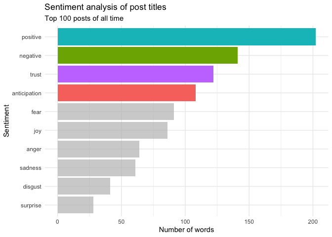<!-- -->

```r
sentiment_year_plot <- year_sentiment %>% 
  group_by(sentiment) %>% 
  summarize(num_words = n()) %>% 
  arrange(desc(num_words)) %>% 
  ggplot(aes(x = num_words, y=reorder(sentiment, num_words), fill=sentiment)) +
  geom_col(show.legend=FALSE) +
  gghighlight(num_words > 100) +
  labs(
    title = "Sentiment analysis of post titles",
    subtitle = "Top 100 posts last year (2022)",
    x = "Number of words",
    y = "Sentiment"
  ) +
  theme_minimal()
sentiment_year_plot
```

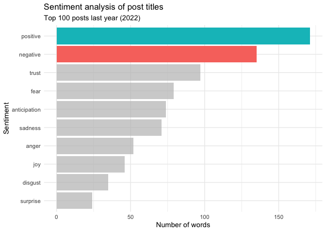<!-- -->

```r
sentiment_month_plot <- month_sentiment %>% 
  group_by(sentiment) %>% 
  summarize(num_words = n()) %>% 
  arrange(desc(num_words)) %>% 
  ggplot(aes(x = num_words, y=reorder(sentiment, num_words), fill=sentiment)) +
  geom_col(show.legend=FALSE) +
  gghighlight(num_words > 100) +
  labs(
    title = "Sentiment analysis of post titles",
    subtitle = "Top 100 posts last month (December 2022)",
    x = "Number of words",
    y = "Sentiment"
  ) +
  theme_minimal()
sentiment_month_plot
```

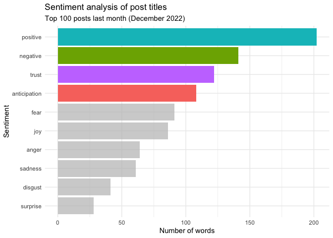<!-- -->


# Conclusions

Overall, r/science most popular posts are pop-science, and favor psychology, social science, and health topics. Posts on r/science come from many sources, though within the past year psypost.org has become overrepresented on the site, and this trend continued through December 2022. These posts are highly upvoted and have high engagement. 

The overall sentiment of posts on r/science is slightly positive. Some words appear very frequently in the post titles. The most frequent post title words are "everyday" words, not specific to science. By contrast, the title words of an open-source journal's blog include more scientific terms.


## Citations

NRC Word-Emotion Association Lexicon: Copyright (C) 2011 National Research Council Canada (NRC)

Version: 0.92
Publicly Released: 10 July 2011
Created By: Dr. Saif M. Mohammad, Dr. Peter Turney
Home Page: http://saifmohammad.com/WebPages/NRC-Emotion-Lexicon.htm

Readme Last Updated: August 2022
Automatic translations from English to 108 languages was last updated: August 2022

Contact: Dr. Saif M. Mohammad (Senior Research Scientist, National Research Council Canada)
saif.mohammad@nrc-cnrc.gc.ca, uvgotsaif@gmail.com
